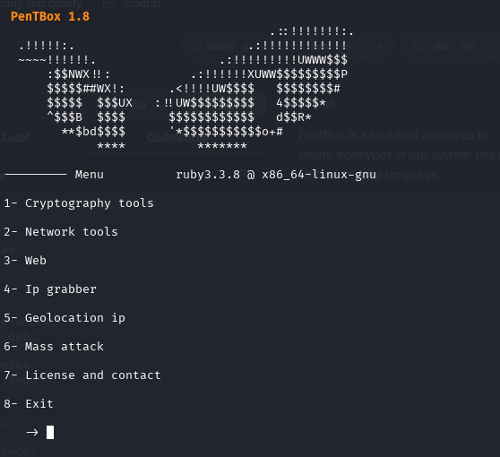
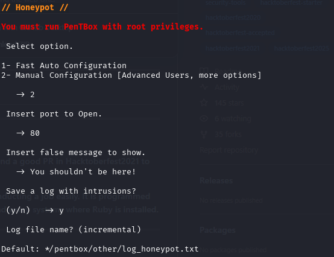
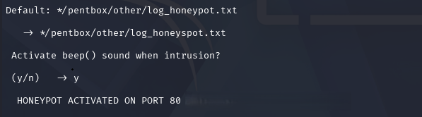

# Honeypot Monitoring and Intrusion Visibility Lab

## Overview

This lab focused on deploying a simple HTTP honeypot to observe inbound access attempts and improve defensive monitoring awareness.

PenTBox was used in Kali Linux to configure a controlled honeypot service on port 80. A browser connection was then used to validate the honeypot response and confirm that the service was active.

The goal of this lab was to understand how honeypots can support threat visibility, intrusion monitoring, and early-stage reconnaissance detection in controlled environments.

---

## Objectives

- Deploy a basic HTTP honeypot service
- Configure honeypot listener settings
- Validate browser access to the honeypot
- Understand how honeypots support network visibility
- Document defensive monitoring concepts

---

## Tools Used

| Tool | Purpose |
|---|---|
| PenTBox | Honeypot deployment and configuration |
| Kali Linux | Controlled lab environment |
| Firefox | Honeypot access validation |

---

## Investigation Workflow

### 1. PenTBox Launch

PenTBox was launched from the Kali Linux terminal to access network security tools.

---

### 2. Honeypot Manual Configuration

The honeypot was configured manually on port 80 with a custom response message and logging options.

---

### 3. Honeypot Service Activation

The honeypot service was activated on port 80 and prepared to monitor inbound access attempts.

---

### 4. Browser Validation

A browser connection was made to the honeypot IP address to validate the HTTP response.

---

## Key Findings

- A basic HTTP honeypot can be deployed to observe inbound access behavior
- Port 80 was used to simulate a web-facing deception service
- Browser validation confirmed the honeypot response message
- Honeypots can improve awareness of unexpected network access attempts
- Deception-based monitoring can support early threat visibility

---

## Detection and Monitoring Concepts

- Honeypot deployment
- Intrusion visibility
- Deception-based monitoring
- Service exposure awareness
- Network access observation
- Early-stage reconnaissance detection

---

## Defensive Value

A simple honeypot can help defenders identify systems or users attempting to access services that should not normally receive traffic.

This can support:
- suspicious access detection
- reconnaissance monitoring
- internal network visibility
- security awareness
- incident investigation support

---

## Limitations

This lab used a simple honeypot in a controlled environment.

It did not include advanced attacker emulation, enterprise telemetry, SIEM correlation, or production-grade honeypot deployment.

---

## Skills Demonstrated

- Honeypot configuration
- Defensive monitoring awareness
- Traffic observation
- Security documentation
- Controlled lab validation
- Deception technology fundamentals

---

## Ethical Notice

This project was conducted in a controlled lab environment for defensive security training and educational purposes only.
