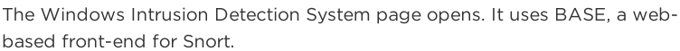
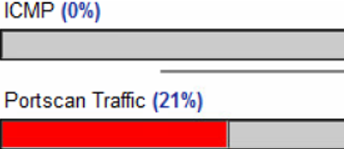
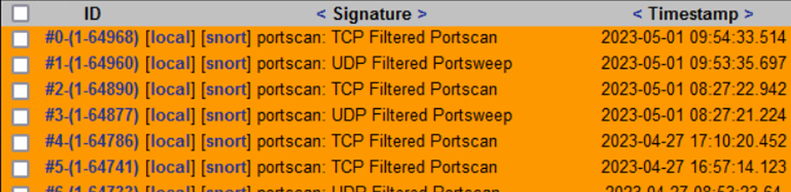
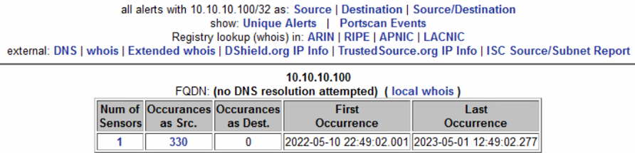

# Snort IDS Port Scan Detection and Alert Analysis

## Overview

This lab focused on detecting and analyzing network reconnaissance activity using the Snort Intrusion Detection System (IDS).

A controlled Nmap port scan was launched from Kali Linux to generate suspicious traffic, while Snort and the BASE alert interface were used to monitor, investigate, and analyze IDS alerts.

The lab also explored alert correlation, traffic visibility, and rule-based detection workflows commonly used in SOC environments.

---

## Objectives

- Detect reconnaissance activity using Snort IDS
- Analyze port scan alerts generated by Nmap
- Investigate source and destination traffic patterns
- Review IDS alert workflows and traffic visibility
- Understand rule-based threat detection concepts

---

## Tools Used

| Tool | Purpose |
|---|---|
| Snort IDS | Intrusion detection and alert generation |
| BASE | Alert visualization and investigation |
| Nmap | Port scanning and reconnaissance simulation |
| Barnyard2 | Snort log processing |
| Kali Linux | Controlled traffic generation |

---

## Investigation Workflow

### 1. Port Scan Traffic Generation

A fast Nmap scan was launched from Kali Linux against the target system to generate detectable reconnaissance traffic.

---

### 2. IDS Alert Dashboard Monitoring

The BASE interface was used to review and monitor alerts generated by Snort.

---

### 3. Port Scan Traffic Visualization

The IDS detected suspicious TCP and UDP scanning activity and categorized the traffic accordingly.

---

### 4. Alert Signature Analysis

Different alert signatures related to port scanning behavior were analyzed within the Snort alert interface.

---

### 5. Source and Destination Correlation

Traffic sources and destinations were reviewed to investigate suspicious communication patterns and reduce false positives.

---

### 6. Alert Occurrence Investigation

Alert frequency and host activity were reviewed to better understand repeated detection events.

---

## Key Findings

- Snort successfully detected reconnaissance activity generated by Nmap
- IDS signatures identified TCP and UDP scanning behavior
- Source and destination analysis improved alert validation
- Traffic profiling improved visibility into suspicious network behavior
- Alert correlation reduced investigation ambiguity
- IDS dashboards improved visibility into suspicious network activity

---

## Detection Engineering Concepts

- Port scan detection
- Signature-based detection
- IDS alert correlation
- Traffic profiling
- False positive awareness
- Source and destination analysis

---

## Skills Demonstrated

- IDS monitoring and analysis
- Network traffic investigation
- Alert triage and correlation
- Detection engineering awareness
- Security operations workflow
- Threat visibility analysis
- Snort rule-based detection concepts
- IDS dashboard interpretation

---

## MITRE ATT&CK Mapping

| Technique | ID | Tactic |
|---|---|---|
| Network Service Scanning | T1046 | Discovery |
| Active Scanning | T1595 | Reconnaissance |

---

## Ethical Notice

This project was conducted in a controlled lab environment for defensive security training and educational purposes only.
