# Windows Malicious Indicator and Memory Investigation

## Overview

This investigation analyzed malicious indicators, persistence-related artifacts, volatile memory evidence, and unusual outbound network activity identified within a compromised Windows environment.

The analysis combined:
- memory forensic investigation
- process-to-network correlation
- persistence artifact analysis
- network connection review
- packet inspection
- suspicious executable analysis

Cross-artifact correlation significantly improved visibility into persistence mechanisms, anomalous communication behavior, and suspicious execution activity.

---

## Investigation Objectives

- Identify suspicious processes and executables
- Correlate active network connections with running processes
- Analyze persistence-related artifacts
- Review volatile memory evidence
- Investigate unusual outbound communication activity
- Validate indicators of compromise (IOCs)

---

## Tools Used

| Tool | Purpose |
|---|---|
| Volatility | Memory forensic analysis |
| DumpIt | Memory acquisition |
| Wireshark | Traffic inspection and packet analysis |
| Process Explorer | Process and network correlation |
| PsList | Process enumeration |
| Autoruns | Persistence artifact analysis |
| Netstat | Active connection review |

---

## Investigation Areas

### 1. Process Analysis

Process analysis identified unusual executables, active communication behavior, and process-related network activity.

Analysis areas included:
- process enumeration
- process-to-network correlation
- executable review
- active communication analysis

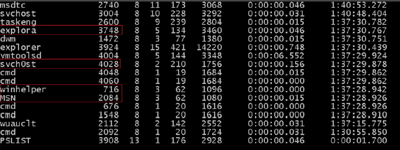

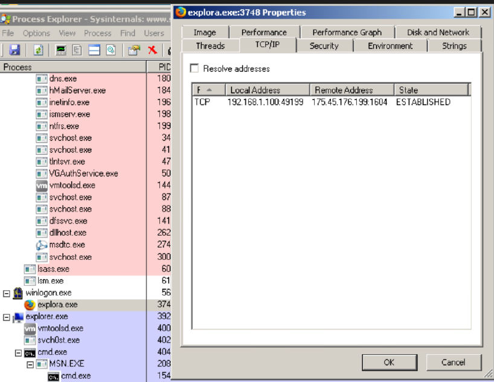

---

### 2. Persistence Artifact Analysis

Persistence-related artifacts were identified through Autoruns analysis and startup-related execution review.

Observed indicators included:
- unusual Run entries
- startup execution behavior
- anomalous executable paths
- persistence-related registry indicators

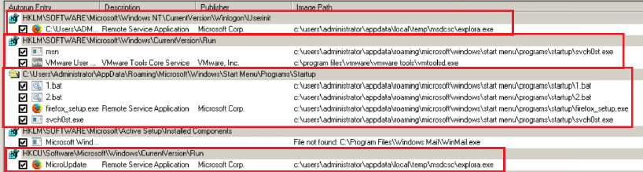

---

### 3. Memory Forensic Analysis

Volatile memory acquisition and forensic analysis identified active processes, established network connections, and process-related communication artifacts.

Observed indicators included:
- unusual processes
- established external connections
- anomalous socket activity
- process-related network artifacts

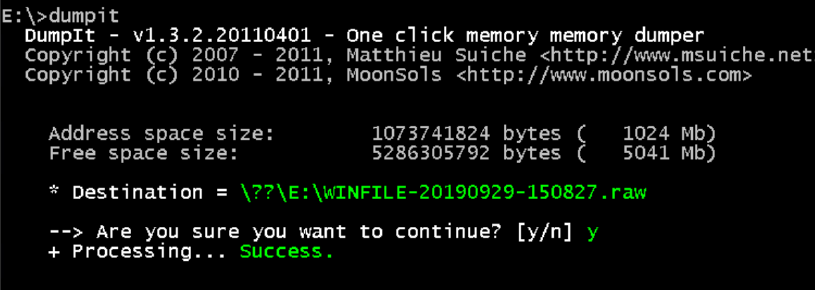

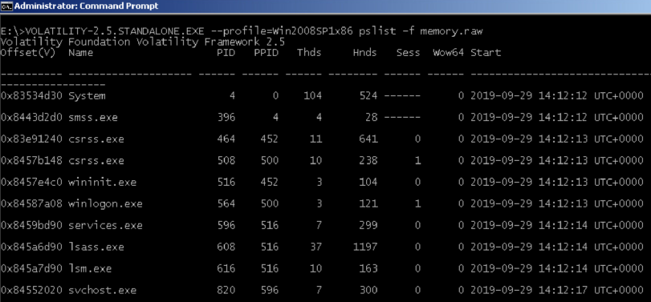

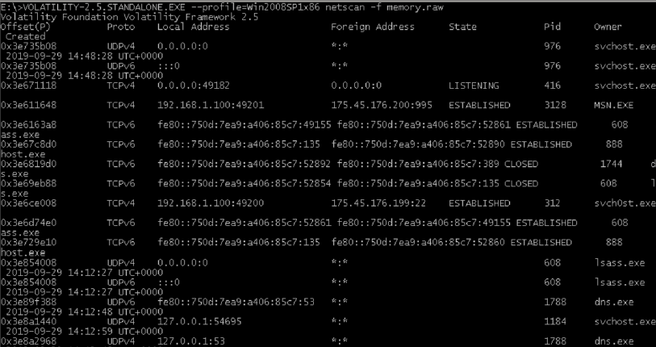

---

### 4. Network Connection Analysis

Network analysis identified unusual outbound communication activity and established sessions associated with persistence-related executables.

Observed indicators included:
- established external sessions
- anomalous outbound traffic
- PID-to-process correlation
- unusual communication patterns

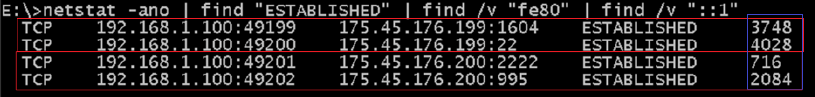

---

### 5. Traffic Inspection and Packet Analysis

Wireshark traffic analysis improved visibility into:
- encrypted SSH communication
- TCP session activity
- reset session behavior
- filtered victim traffic analysis

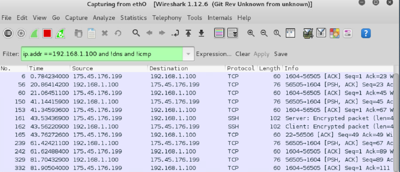

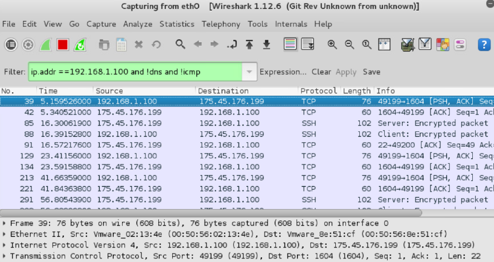

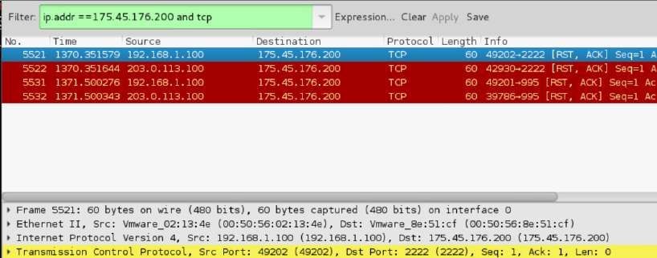

---

### 6. File System Artifact Analysis

File system analysis identified unusual binaries and suspicious executable placement within sensitive operating system directories.

Observed indicators included:
- anomalous executables
- fake Windows-style filenames
- unusual file creation timelines
- executables located within System32

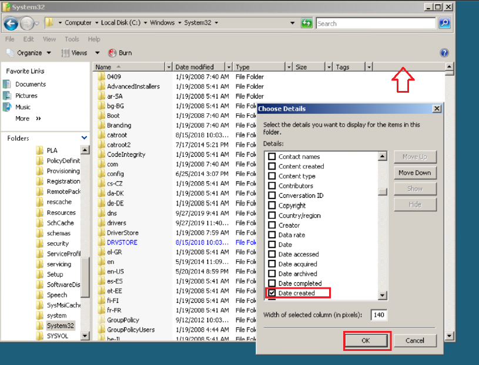

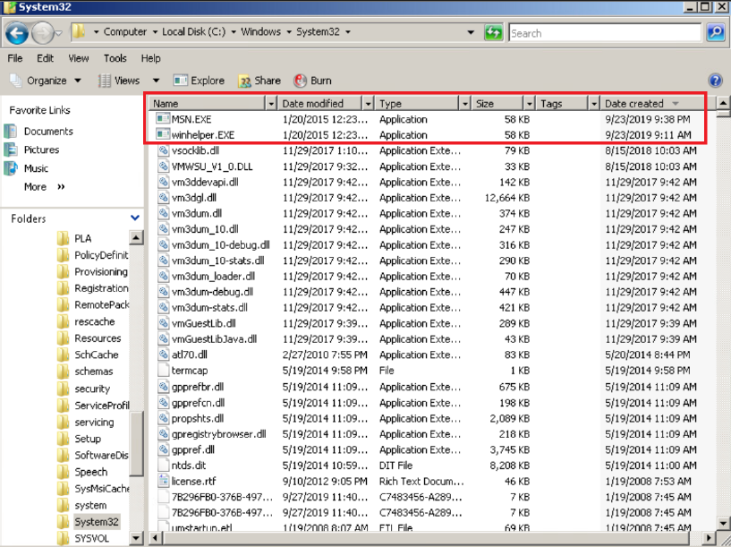

---

## Key Findings

The investigation identified multiple indicators associated with persistence-related execution behavior and unusual outbound communication activity.

Observed indicators included:
- explora.exe
- svch0st.exe
- winhelper.EXE
- persistence-related startup entries
- anomalous outbound communication
- established external sessions
- unusual executable placement

Cross-artifact correlation significantly improved investigative visibility and IOC validation accuracy.

---

## Detection Concepts

- Persistence artifact analysis
- Volatile memory investigation
- Process-to-network correlation
- Outbound communication analysis
- Masquerading-style filename detection
- Startup execution analysis
- IOC validation workflows
- Traffic inspection and packet analysis

---

## Defensive Investigation Value

This investigation demonstrated how layered forensic analysis techniques improve:
- persistence visibility
- process investigation
- memory forensic visibility
- network artifact correlation
- incident response workflows
- defensive investigation operations

Combining memory analysis, persistence review, and network inspection significantly improves visibility into anomalous system behavior.

---

## Skills Demonstrated

- DFIR investigation and artifact correlation
- Memory forensic analysis and volatile evidence review
- Process, persistence, and network activity analysis
- Traffic inspection and IOC validation
- Cross-artifact forensic investigation workflows

---

## Ethical Notice

This investigation was performed within a controlled security lab environment for defensive security research and DFIR training purposes only.
