# Windows Network Compromise Investigation and Persistence Analysis

## Overview

This investigation focused on analyzing indicators of compromise (IOCs), persistence mechanisms, suspicious services, and volatile evidence within a compromised Windows environment.

The lab simulated a defensive incident response workflow involving:
- volatile data collection
- memory acquisition
- persistence investigation
- suspicious service analysis
- startup artifact review
- scheduled task analysis
- network connection investigation

Several suspicious artifacts were identified, including:
- fake Windows binaries
- suspicious scheduled tasks
- unknown Windows services
- startup persistence files
- suspicious outbound network connections

The investigation also demonstrated how memory forensics and persistence analysis can improve threat visibility and support defensive investigation workflows.

---

## Objectives

- Perform volatile data collection
- Capture system memory for forensic analysis
- Investigate suspicious established network connections
- Identify persistence mechanisms
- Analyze suspicious Windows services
- Review startup folder artifacts
- Investigate scheduled task persistence
- Correlate suspicious indicators across multiple artifacts

---

## Tools Used

| Tool | Purpose |
|---|---|
| DumpIt | Volatile memory acquisition |
| Volatility Framework | Memory forensic analysis |
| Autoruns | Persistence artifact investigation |
| Windows Task Scheduler | Scheduled task analysis |
| MSConfig | Service investigation |
| Netstat | Network connection review |
| Windows Explorer | File system investigation |

---

## Investigation Workflow

### 1. Local Administrator Review

Local administrator membership and privileged access visibility were reviewed during the investigation process.

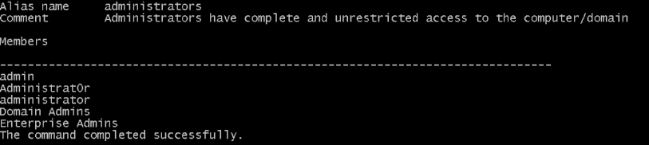

---

### 2. Volatile Data Collection

Established network connections were reviewed to identify suspicious communication activity and potential suspicious communication indicators.

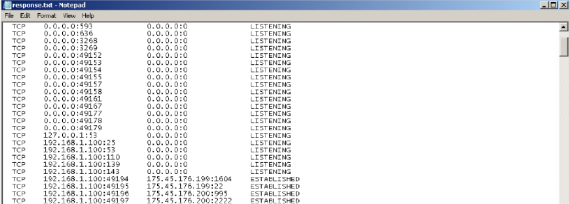

---

### 3. Memory Acquisition

System memory was captured using DumpIt to preserve volatile evidence for forensic investigation.

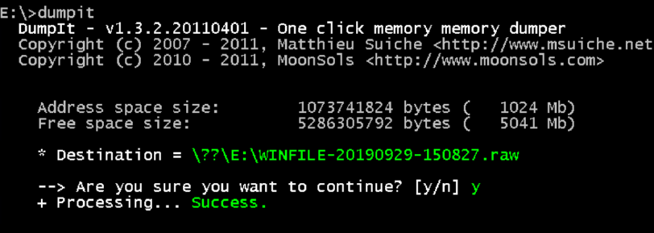

---

### 4. Memory Forensic Analysis

Volatility netscan analysis identified suspicious established connections associated with unusual executables and remote communication activity.

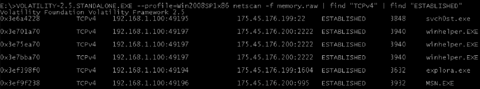

---

### 5. Scheduled Task Persistence Analysis

Suspicious scheduled tasks were reviewed to identify persistence behavior and unauthorized automatic execution activity.

#### Explora Persistence Task

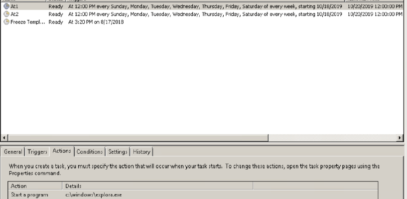

#### Svchost Persistence Task

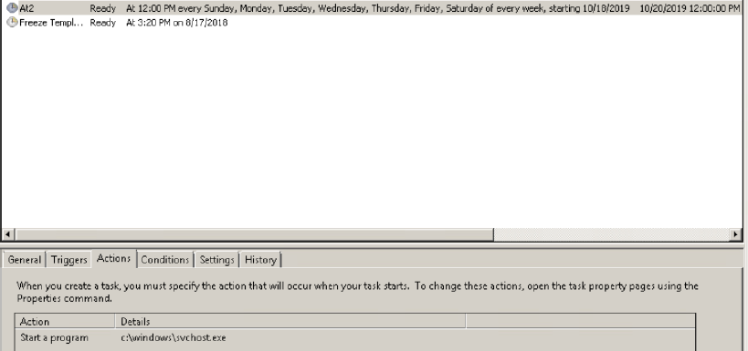

---

### 6. Startup Folder Artifact Analysis

Startup folder contents were reviewed to identify suspicious executables and batch file persistence artifacts.

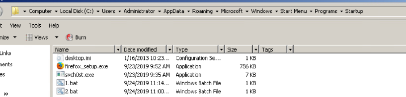

---

### 7. Batch File Persistence Investigation

A suspicious batch file containing remote command execution behavior and external communication indicators was identified during the investigation.

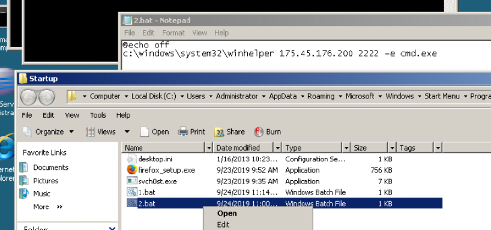

---

### 8. Suspicious Binary Analysis

Suspicious executables located within the Windows System32 directory were identified and reviewed during file system analysis.

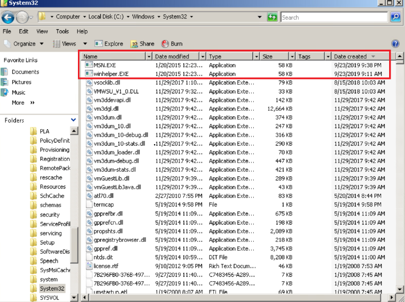

---

### 9. Service Persistence Investigation

Persistence artifacts associated with suspicious Windows services were investigated using Autoruns and service configuration analysis tools.

#### Autoruns Persistence Review

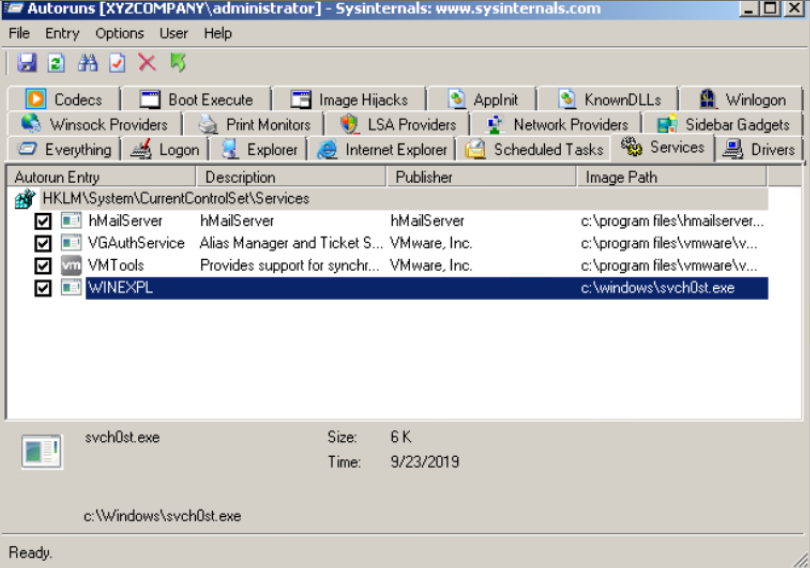

#### Unknown Service Manufacturer

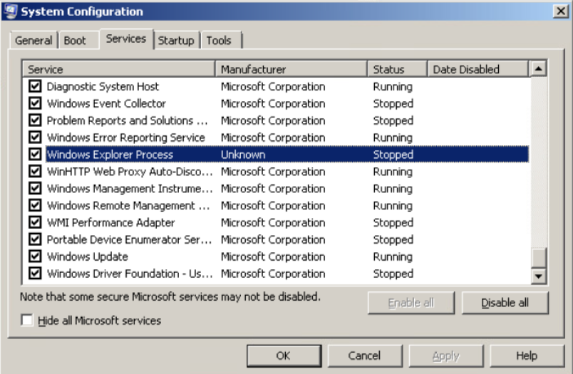

#### Suspicious Service Executable Path

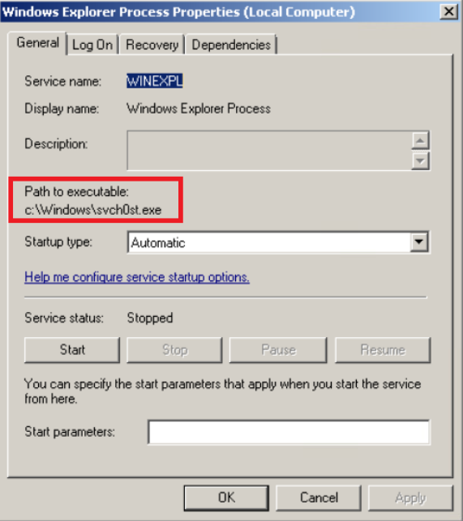

---

## Key Findings

- Multiple persistence mechanisms were identified across the compromised system
- Suspicious scheduled tasks were configured for automatic execution
- Fake Windows-style executables were identified within sensitive directories
- Suspicious outbound network connections were observed during memory analysis
- Startup folder artifacts indicated unauthorized execution behavior
- Unknown Windows services demonstrated persistence-related indicators
- Memory forensic analysis improved visibility into suspicious process activity

---

## Indicators of Compromise (IOCs)

| IOC Type | Observation |
|---|---|
| Suspicious Binary | svch0st.exe |
| Suspicious Binary | explora.exe |
| Suspicious Binary | winhelper.EXE |
| Suspicious Network Activity | External connections over port 2222 |
| Persistence Mechanism | Scheduled tasks |
| Persistence Mechanism | Startup folder batch files |
| Persistence Mechanism | Suspicious Windows services |

---

## Skills Demonstrated

- Windows incident response
- Volatile data collection
- Memory forensic analysis
- IOC correlation
- Persistence analysis
- Scheduled task investigation
- Service analysis
- Startup artifact investigation
- Defensive investigation workflows
- DFIR documentation

---

## MITRE ATT&CK Mapping

| Technique | ID | Tactic |
|---|---|---|
| Scheduled Task/Job | T1053 | Persistence |
| Boot or Logon Autostart Execution | T1547 | Persistence |
| Windows Service | T1543 | Persistence |
| Masquerading | T1036 | Defense Evasion |
| Command and Scripting Interpreter | T1059 | Execution |
| System Owner/User Discovery | T1033 | Discovery |

---

## Ethical Notice

This investigation was conducted in a controlled lab environment for defensive security training, incident response education, and DFIR skill development purposes only.
