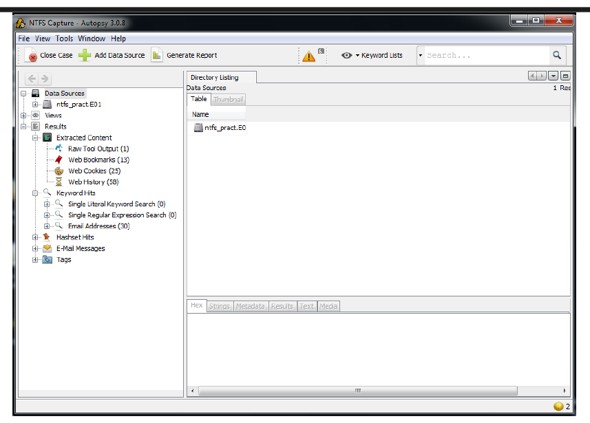
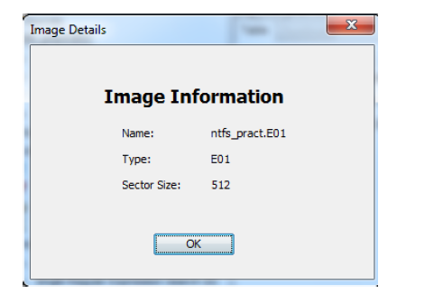

# Autopsy Disk Image Forensic Analysis

## Investigation Overview

This project documents a forensic review workflow performed against an E01 disk image using the Autopsy Forensic Browser. The investigation focused on filesystem visibility, registry artifact inspection, categorized evidence review, and forensic reporting workflows within an NTFS-based evidence source.

The analysis included evidence source validation, NTFS volume inspection, artifact categorization, registry hive review, tagged evidence handling, and report generation activities.

---

## Investigation Scope

The investigation focused on the following forensic areas:

- E01 evidence source validation
- NTFS volume structure analysis
- Registry artifact inspection
- File categorization review
- Document content analysis
- Media artifact visibility
- Tagged evidence workflows
- HTML forensic report generation

---

## Tools Used

| Tool | Purpose |
|------|----------|
| Autopsy 3.0.8 | Disk image forensic analysis |
| The Sleuth Kit (TSK) | Filesystem parsing and forensic processing |
| NTFS Disk Image (E01) | Evidence source |
| Hex Viewer | Binary artifact inspection |

---

## Analysis Areas

### Evidence Source Validation

The evidence image was reviewed to verify image format metadata, sector size information, and evidence source integrity prior to analysis activities.

---

### NTFS Volume Analysis

The investigation reviewed NTFS volume allocation details, sector offsets, and filesystem structure visibility from the loaded disk image.

---

### Registry Artifact Inspection

Registry hive artifacts were reviewed through both parsed text visibility and hexadecimal inspection views to validate artifact accessibility and low-level evidence visibility.

#### NTUSER.DAT Text Analysis

#### NTUSER.DAT Hex Analysis

---

### Artifact Categorization Review

Autopsy parsed and categorized evidence artifacts across multiple content types, including images, videos, and office documents.

#### Image Artifact Review

#### Video Artifact Review

#### Office Document Analysis

---

### Document Content Review

Autopsy parsing functionality was used to inspect extracted textual content from recovered office documents.

---

### Tagged Evidence Workflow

Relevant artifacts were tagged for inclusion in forensic reporting workflows to support evidence tracking and investigative documentation.

---

### Forensic Report Generation

Autopsy reporting functionality was used to generate structured forensic reporting output from tagged evidence artifacts.

#### Report Overview

#### Tagged Evidence Report

---

## Investigation Findings

- Successfully validated E01 evidence metadata and NTFS volume structure
- Reviewed registry hive artifacts through parsed and hexadecimal visibility
- Identified categorized evidence artifacts across image, video, and document sources
- Performed extracted document content review
- Applied tagged evidence workflows for reporting correlation
- Generated structured HTML forensic reporting output

---

## Defensive Value

This project demonstrates practical forensic analysis workflows associated with:

- Disk image investigations
- NTFS evidence review
- Registry artifact visibility
- Evidence categorization
- Tagged evidence handling
- Forensic reporting processes
- Artifact review methodology

---

## Environment Details

| Component | Details |
|-----------|---------|
| Operating System | Windows 7 |
| File System | NTFS |
| Evidence Format | E01 |
| Analysis Platform | Autopsy 3.0.8 |
| Investigation Type | Disk Image Forensic Analysis |

---

## Analyst Assessment

The investigation demonstrated how forensic tooling can provide structured visibility into filesystem artifacts, registry data, categorized evidence sources, and reporting workflows from acquired disk images.

The workflow also highlighted the importance of evidence organization, artifact tagging, and report generation during forensic review activities.
