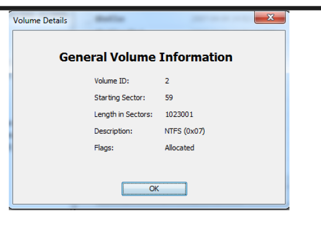
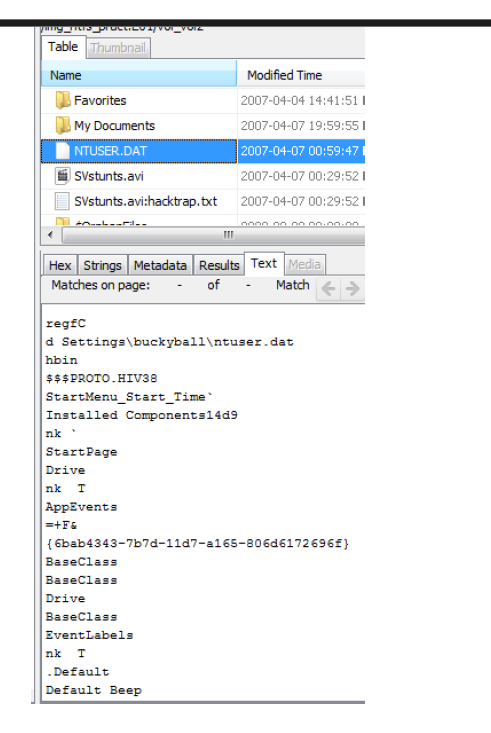
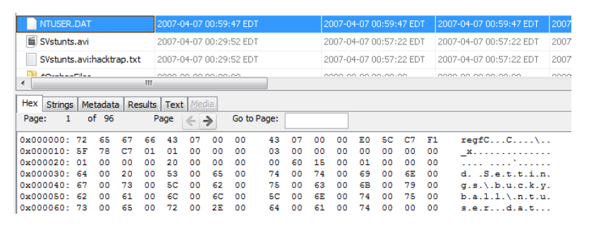
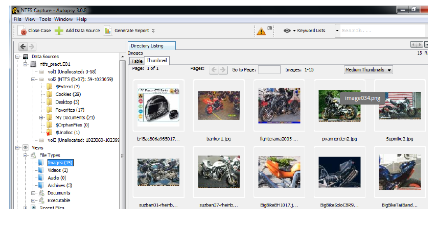
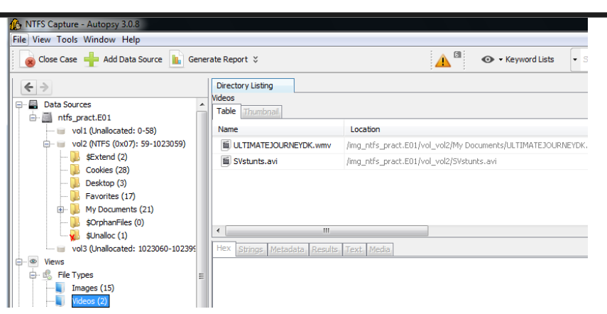
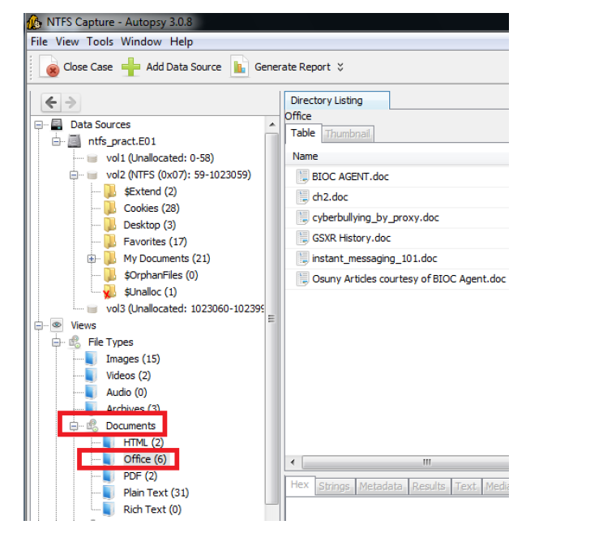
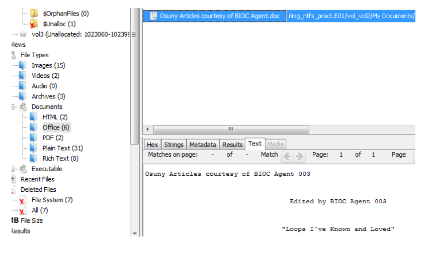
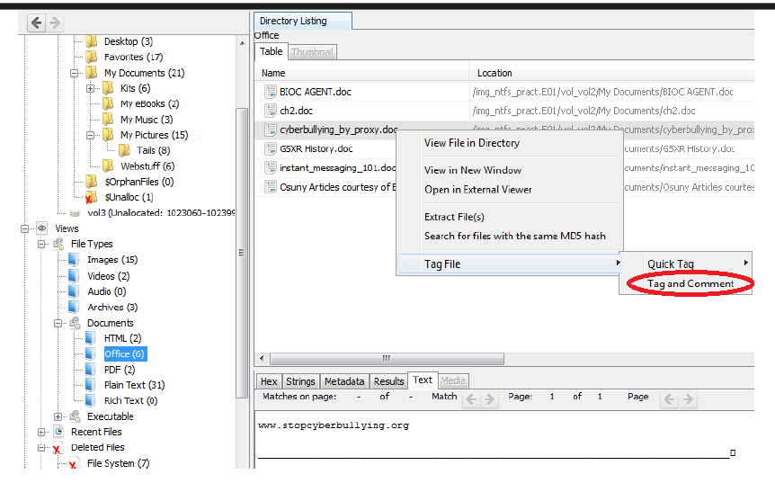
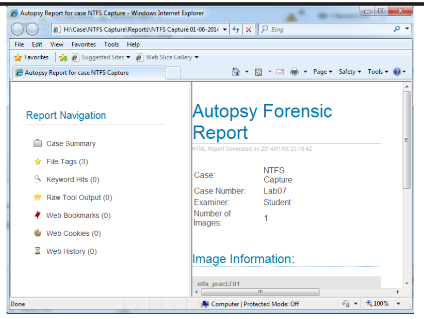
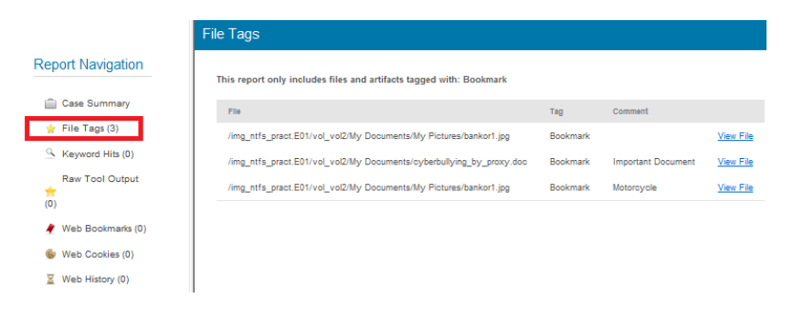

# Investigation Notes

## Investigation Context

This investigation focused on reviewing an NTFS-based E01 forensic image through the Autopsy Forensic Browser. The workflow emphasized artifact visibility, filesystem analysis, registry inspection, evidence categorization, and forensic reporting activities.

The investigation was performed within a controlled forensic analysis environment using Autopsy 3.0.8 and The Sleuth Kit (TSK).

---

## Evidence Handling Notes

The evidence source was processed as an E01 forensic image to preserve disk structure visibility and maintain forensic consistency during analysis activities.

Observed evidence handling areas included:

- Disk image ingestion workflows
- Evidence metadata visibility
- NTFS volume accessibility
- Structured evidence navigation
- Artifact review consistency

---

## Filesystem Analysis Notes

The investigation confirmed visibility into:

- NTFS partition structure
- Sector allocation details
- Allocated and unallocated space
- Parsed filesystem artifacts
- Categorized evidence sources

The filesystem structure provided organized navigation across extracted evidence artifacts and supported efficient forensic review workflows.

---

## Registry Review Notes

Registry analysis activities focused on NTUSER.DAT artifact visibility through both parsed and hexadecimal review methods.

The investigation demonstrated:

- Registry hive accessibility
- Parsed content visibility
- Raw hexadecimal inspection
- Low-level artifact review workflows

The ability to inspect both parsed and raw artifact representations improves analyst validation capabilities during forensic investigations.

### Parsed Registry View

### Hexadecimal Registry View

---

## Artifact Categorization Notes

Autopsy successfully parsed and grouped evidence artifacts into categorized views, including:

- Images
- Videos
- Office documents
- Parsed textual content

Categorized artifact visibility streamlined navigation and reduced manual review complexity during investigation activities.

### Image Artifact Visibility

### Video Artifact Visibility

### Office Document Visibility

---

## Document Parsing Notes

Recovered office documents were successfully parsed and rendered through Autopsy content review functionality.

The parsed document visibility demonstrated:

- Text extraction accessibility
- Readable content rendering
- Structured document review workflows

---

## Reporting Workflow Notes

Tagged evidence workflows improved investigation organization and enabled structured reporting generation from selected forensic artifacts.

Observed workflow advantages included:

- Evidence prioritization
- Artifact tracking
- Structured reporting preparation
- Investigation documentation consistency

### Tagged Artifact Workflow

### Report Visibility

### Tagged Evidence Reporting

---

## Tooling Observations

Autopsy provided centralized visibility into:

- Filesystem artifacts
- Registry hives
- Media artifacts
- Document parsing
- Tagged evidence handling
- Structured forensic reporting

The integration with The Sleuth Kit improved evidence parsing and artifact review workflows throughout the investigation.

---

## Investigation Limitations

This investigation focused on forensic artifact visibility and evidence review workflows within the provided E01 evidence source.

The investigation did not include:

- Live memory acquisition
- Network traffic analysis
- Malware reverse engineering
- Live endpoint triage
- Threat attribution activities

---

## Analyst Notes

The investigation demonstrated how forensic tooling can improve evidence accessibility, artifact organization, and reporting consistency during disk image analysis operations.

The workflow also reinforced the operational importance of structured evidence review, artifact correlation, and investigation documentation within DFIR processes.
