# Windows Registry Forensic Analysis

## Overview

This investigation focused on offline Windows Registry forensic analysis within a controlled DFIR lab environment.

The objective was to analyze:
- Windows Registry hive acquisition
- SAM user enumeration
- Windows installation artifacts
- startup application entries
- TCP/IP configuration artifacts
- services and drivers
- NTUSER.DAT user artifacts
- registry-based forensic visibility

Offline registry forensic analysis strengthened investigative visibility into:
- system configuration
- user activity
- startup behavior
- operating system artifacts
- registry-linked forensic evidence

---

# Investigation Scope

The investigation included analysis of:
- SAM registry hive
- SOFTWARE registry hive
- SYSTEM registry hive
- NTUSER.DAT user hive
- registry acquisition workflows
- registry validation analysis

The investigation focused on defensive forensic analysis and artifact correlation workflows commonly used during DFIR investigations.

---

# Tools Used

| Tool | Purpose |
|---|---|
| FTK Imager | Registry hive acquisition |
| Windows Registry Recovery (WRR) | Offline registry analysis |
| Regedit | Registry validation and comparison |
| Windows Explorer | Registry artifact review |

---

# Analysis Areas

## 1. Registry Acquisition

Registry hives were acquired using FTK Imager to support offline forensic analysis.

Acquired artifacts included:
- SAM
- SECURITY
- SOFTWARE
- SYSTEM
- NTUSER.DAT

The acquisition workflow improved forensic preservation and enabled structured offline registry investigation.

### Registry Acquisition Evidence

#### FTK Imager — Obtain Protected Files

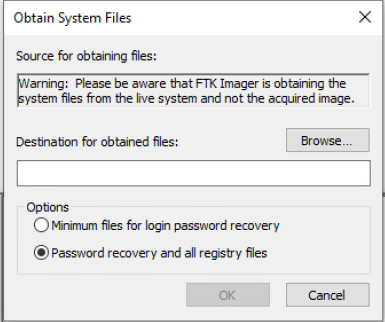

#### FTK Imager — Registry Export Options

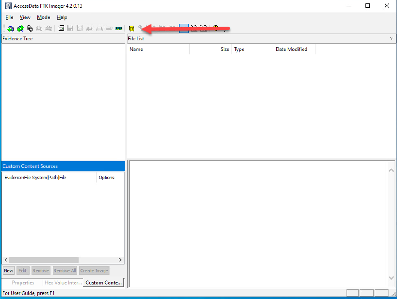

#### Registry Hive Files Exported

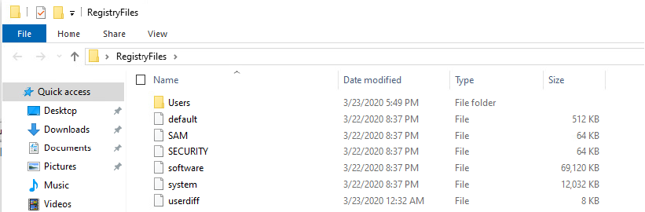

---

## 2. SAM Analysis

SAM analysis identified:
- local user accounts
- built-in accounts
- SID information
- account-related registry artifacts

SAM analysis strengthened visibility into local account enumeration and authentication-related forensic evidence.

### SAM Analysis Evidence

#### SAM Hive Loaded

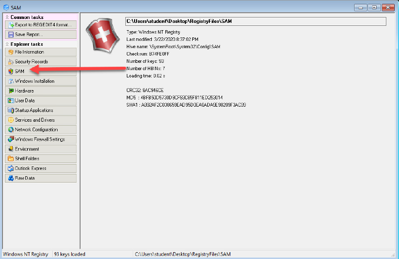

#### User Enumeration Analysis

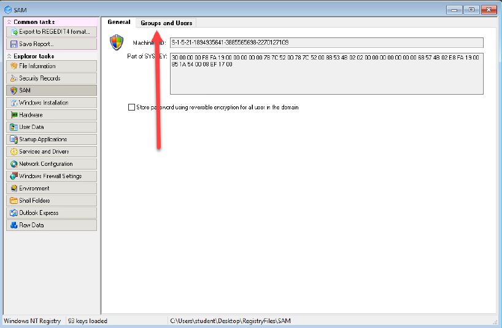

#### Administrator SID Analysis

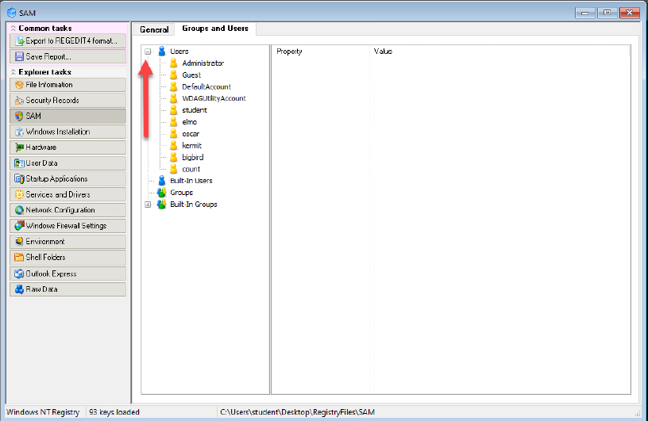

#### Guest SID Analysis

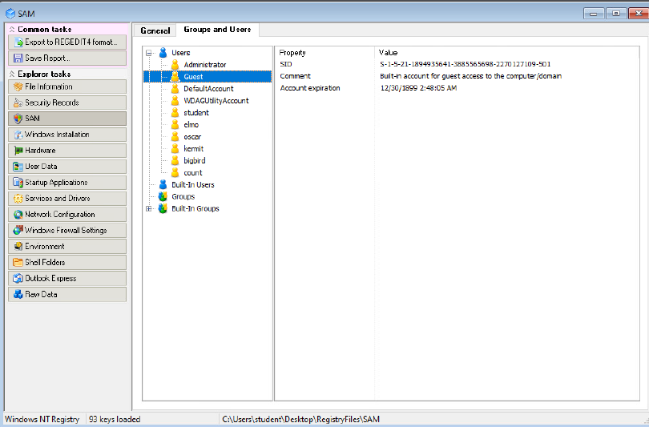

---

## 3. SOFTWARE Hive Analysis

SOFTWARE hive analysis identified:
- Windows installation details
- startup application entries
- operating system configuration artifacts
- installed software information

SOFTWARE hive correlation strengthened investigative context surrounding startup execution behavior and operating system metadata.

### SOFTWARE Hive Evidence

#### Windows Installation Analysis

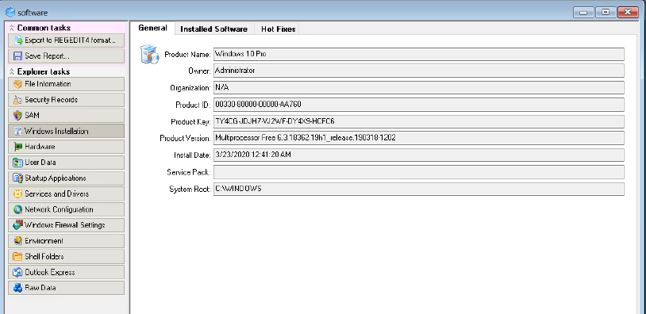

#### Startup Applications Analysis

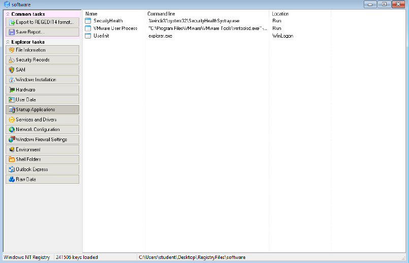

---

## 4. SYSTEM Hive Analysis

SYSTEM hive analysis identified:
- services and drivers
- TCP/IP configuration artifacts
- network adapter information
- DHCP-related configuration data

SYSTEM hive analysis improved visibility into system-level registry artifacts and network-related forensic evidence.

### SYSTEM Hive Evidence

#### Services and Drivers Analysis

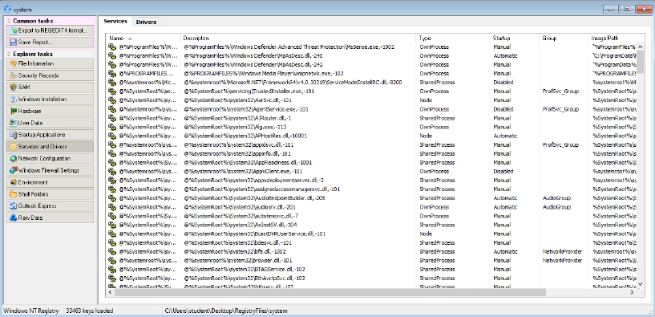

#### TCP/IP Network Configuration Analysis

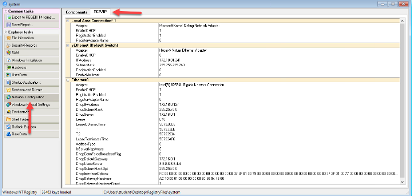

---

## 5. NTUSER.DAT Analysis

NTUSER.DAT analysis identified:
- user startup entries
- shell folder paths
- user-specific configuration artifacts
- profile-related registry data

User hive analysis significantly improved visibility into profile-level forensic artifacts and startup-related registry evidence.

### NTUSER.DAT Evidence

#### NTUSER.DAT Loaded

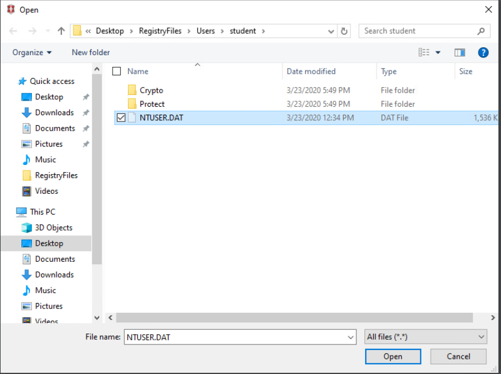

#### User Startup Applications Analysis

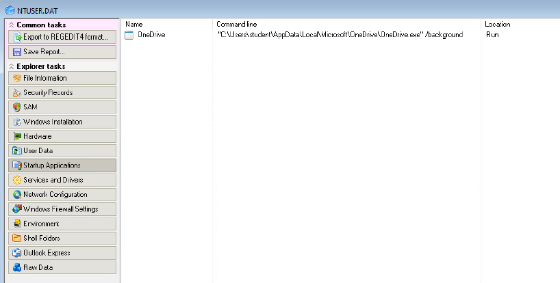

#### Shell Folder Analysis

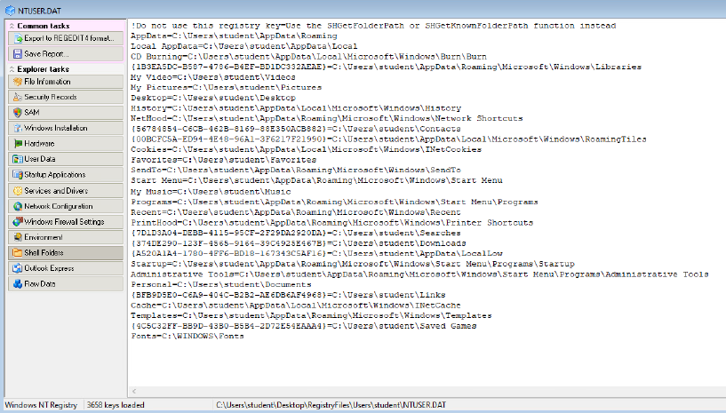

---

## 6. Registry Validation Analysis

Additional validation analysis was performed using Windows Regedit to compare:
- locale configuration
- network interface registry artifacts
- live registry structures
- registry path visibility

Validation workflows improved confidence in registry artifact interpretation and forensic consistency.

### Validation Evidence

#### Locale Settings Analysis

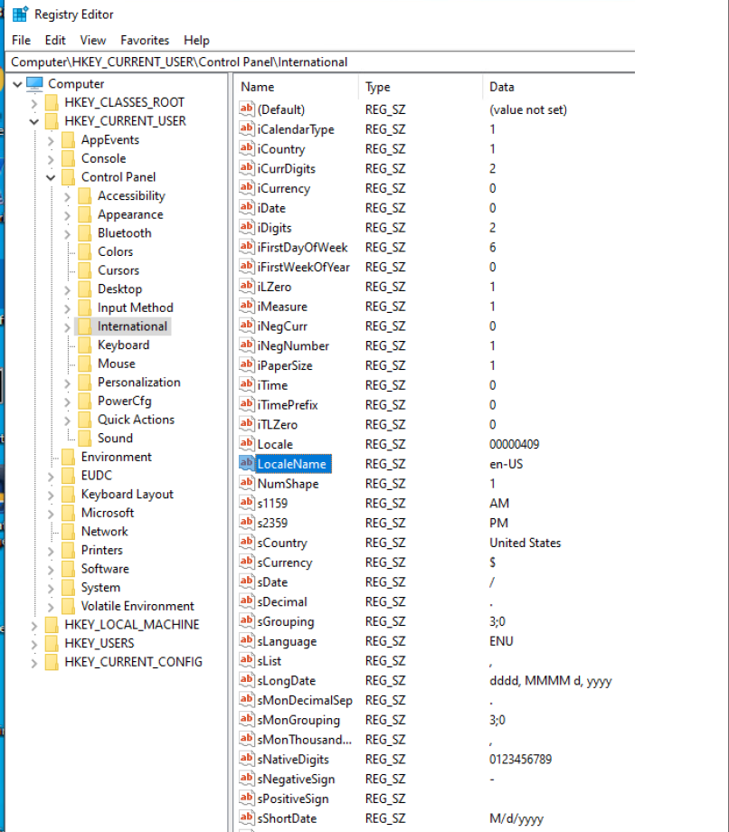

#### Network Interface Analysis

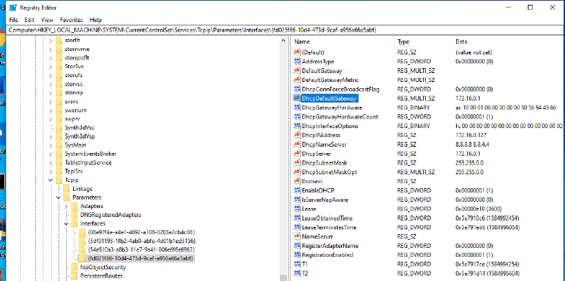

---

# Key Forensic Observations

Notable registry-based forensic observations included:
- startup-related application entries
- SID-linked account artifacts
- shell folder registry paths
- services and drivers configuration artifacts
- TCP/IP-related registry evidence
- profile-level startup behavior

Cross-hive correlation significantly strengthened investigative context surrounding:
- user activity
- startup behavior
- operating system configuration
- network-related registry artifacts
- profile-level forensic evidence

---

# Defensive Value

This investigation demonstrated the importance of:
- offline registry analysis
- hive acquisition workflows
- registry artifact correlation
- startup persistence visibility
- user artifact analysis
- system configuration analysis
- forensic validation workflows

Registry forensics significantly improves visibility during DFIR investigations and incident response operations.

---

# Environment Details

| Component | Details |
|---|---|
| Operating System | Windows 10 |
| Investigation Type | DFIR / Registry Forensics |
| Acquisition Tool | FTK Imager |
| Registry Analysis Tool | Windows Registry Recovery |
| Validation Method | Regedit Analysis |
| Investigation Environment | Controlled Security Lab |

---

# Analyst Assessment

This investigation reinforced the importance of correlating multiple registry hives rather than relying on isolated registry artifacts alone.

Combining:
- SAM analysis
- SOFTWARE analysis
- SYSTEM analysis
- NTUSER.DAT analysis
- registry validation workflows

significantly improved visibility into:
- user activity
- startup behavior
- operating system configuration
- network configuration
- registry-based persistence artifacts
- profile-level forensic evidence

Layered registry forensic analysis significantly strengthened investigative accuracy and DFIR operational visibility.# Windows Registry Forensic Analysis

## Overview

This investigation focused on offline Windows Registry forensic analysis within a controlled DFIR lab environment.

The objective was to analyze:
- Windows Registry hive acquisition
- SAM user enumeration
- Windows installation artifacts
- startup application entries
- TCP/IP configuration artifacts
- services and drivers
- NTUSER.DAT user artifacts
- registry-based forensic visibility

The investigation used offline registry analysis techniques to improve visibility into system configuration, user activity, startup behavior, and operating system artifacts.

---

# Investigation Scope

The investigation included analysis of:
- SAM registry hive
- SOFTWARE registry hive
- SYSTEM registry hive
- NTUSER.DAT user hive
- registry acquisition workflows
- registry validation analysis

The investigation focused on defensive forensic analysis and artifact correlation workflows commonly used during DFIR investigations.

---

# Tools Used

| Tool | Purpose |
|---|---|
| FTK Imager | Registry hive acquisition |
| Windows Registry Recovery (WRR) | Offline registry analysis |
| Regedit | Registry validation and comparison |
| Windows Explorer | Registry artifact review |

---

# Analysis Areas

## 1. Registry Acquisition

Registry hives were acquired using FTK Imager to support offline forensic analysis.

Acquired artifacts included:
- SAM
- SECURITY
- SOFTWARE
- SYSTEM
- NTUSER.DAT

The acquisition process improved forensic preservation and offline investigation visibility.

---

## 2. SAM Analysis

SAM analysis identified:
- local user accounts
- built-in accounts
- SID information
- account-related registry artifacts

The investigation improved visibility into local account enumeration and user-related forensic evidence.

---

## 3. SOFTWARE Hive Analysis

SOFTWARE hive analysis identified:
- Windows installation details
- startup application entries
- operating system configuration artifacts
- installed software information

The investigation improved visibility into startup execution behavior and operating system metadata.

---

## 4. SYSTEM Hive Analysis

SYSTEM hive analysis identified:
- services and drivers
- TCP/IP configuration artifacts
- network adapter information
- DHCP-related configuration data

The investigation improved visibility into system-level configuration artifacts and network-related registry evidence.

---

## 5. NTUSER.DAT Analysis

NTUSER.DAT analysis identified:
- user startup entries
- shell folder paths
- user-specific configuration artifacts
- profile-related registry data

The investigation improved visibility into user-level forensic artifacts and profile-based registry evidence.

---

## 6. Registry Validation Analysis

Additional validation analysis was performed using Windows Regedit to compare:
- locale configuration
- network interface registry artifacts
- live registry structures
- registry path visibility

Validation analysis improved confidence in registry artifact interpretation and forensic consistency.

---

# Key Investigation Findings

The investigation identified:
- startup application registry entries
- local account enumeration artifacts
- SID-related information
- operating system installation details
- network configuration artifacts
- shell folder registry paths
- user profile registry artifacts
- service and driver configuration entries

Cross-hive analysis significantly improved forensic visibility into operating system behavior and registry-based system artifacts.

---

# Defensive Value

This investigation demonstrated the importance of:
- offline registry analysis
- hive acquisition workflows
- registry artifact correlation
- startup persistence visibility
- user artifact analysis
- system configuration analysis
- forensic validation workflows

Registry forensics significantly improves visibility during DFIR investigations and incident response operations.

---

# Environment Details

| Component | Details |
|---|---|
| Operating System | Windows 10 |
| Investigation Type | DFIR / Registry Forensics |
| Acquisition Tool | FTK Imager |
| Registry Analysis Tool | Windows Registry Recovery |
| Validation Method | Regedit Analysis |
| Investigation Environment | Controlled Security Lab |

---

# Analyst Assessment

This investigation reinforced the importance of correlating multiple registry hives rather than relying on isolated registry artifacts alone.

Combining SAM analysis, SOFTWARE analysis, SYSTEM analysis, and NTUSER.DAT analysis significantly improved forensic visibility into:
- user activity
- startup behavior
- operating system configuration
- network configuration
- registry-based persistence artifacts

Layered registry forensic analysis strengthens investigative accuracy and DFIR operational visibility.
