# Mitigations & Defensive Recommendations

## Hardening Overview

This assessment focused on improving enterprise security posture through centralized Active Directory administration, password policy hardening, Group Policy enforcement, and organizational restriction management within a Windows domain environment.

Hardening activities emphasized:

- Centralized identity management
- Password security enforcement
- Policy-based restriction controls
- Administrative segmentation
- Enterprise configuration consistency
- Group Policy validation workflows

---

## Active Directory Administration Recommendations

Active Directory should be centrally managed using structured Organizational Units (OU) and clearly defined administrative boundaries.

Recommended controls include:

- Separate users by department or function
- Implement OU-based policy segmentation
- Limit unnecessary administrative access
- Review domain objects regularly
- Standardize account provisioning workflows

Centralized administration improves:

- Visibility
- Scalability
- Administrative consistency
- Enterprise policy management

#### ADUC Administration Visibility

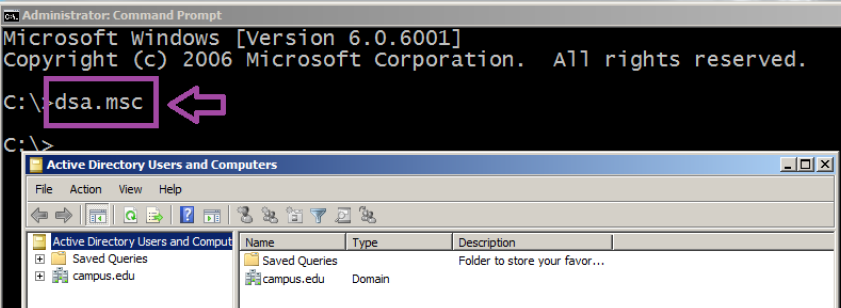

---

## Organizational Unit Recommendations

Organizational Units (OU) should be used to separate systems and users according to operational or security requirements.

Recommended OU practices include:

- Separate privileged users
- Separate administrative systems
- Scope policies by business role
- Delegate administration carefully
- Apply least privilege principles

OU segmentation improves:

- Policy targeting
- Administrative delegation
- Security isolation
- Enterprise organization

#### Organizational Unit Creation

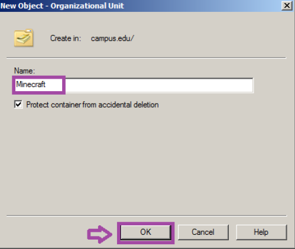

---

## Identity Management Recommendations

Enterprise user provisioning workflows should follow consistent identity management procedures.

Recommended controls include:

- Standardized account naming
- Strong password enforcement
- User lifecycle management
- Access review procedures
- Privileged account monitoring

The assessment demonstrated how centralized provisioning improves:

- Authentication consistency
- Administrative visibility
- Access governance
- Identity accountability

### Domain User Provisioning

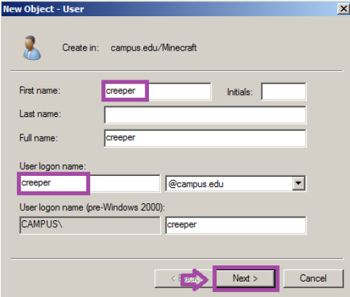

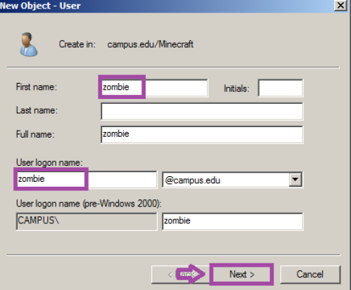

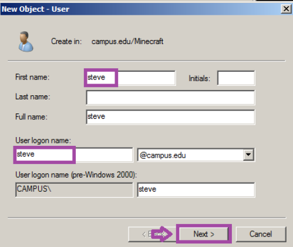

---

## Group Policy Hardening Recommendations

Group Policy Objects (GPO) should be centrally managed and regularly reviewed to maintain enterprise-wide security consistency.

Recommended controls include:

- Review domain-level policies regularly
- Avoid unnecessary default configurations
- Validate inheritance behavior
- Test policy deployments before production rollout
- Audit GPO changes continuously

Centralized GPO management improves:

- Configuration consistency
- Administrative control
- Enterprise hardening
- Security policy enforcement

### Group Policy Management Visibility

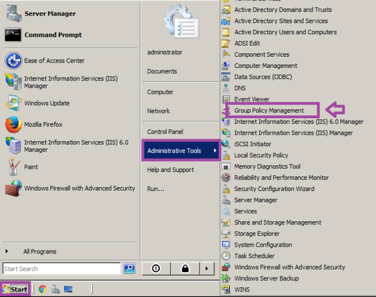

### Default Domain Policy Review

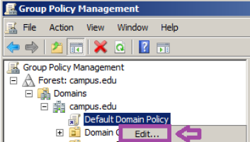

---

## Password Policy Recommendations

Strong password policies should be enforced across all domain-managed systems.

Recommended password controls include:

- Minimum password length requirements
- Password complexity enforcement
- Password expiration policies
- Account lockout protections
- Authentication auditing

The assessment demonstrated how centralized password policies improve:

- Credential security
- Authentication resilience
- Enterprise-wide consistency
- Brute-force resistance

### Password Policy Review

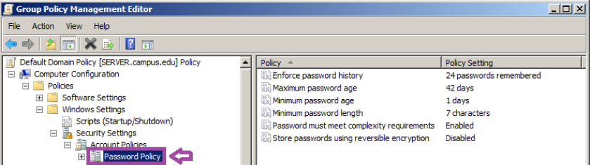

### Password Enforcement Validation

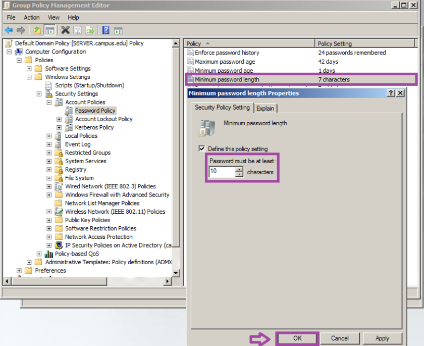

---

## Organizational Restriction Recommendations

OU-level policies should be used to restrict unnecessary user functionality and reduce unauthorized system modification risks.

Recommended controls include:

- Restrict Control Panel access where appropriate
- Limit local administrative privileges
- Prevent unauthorized configuration changes
- Apply role-based restrictions
- Validate policy inheritance regularly

These restrictions improve:

- Endpoint consistency
- User behavior control
- Administrative enforcement
- Configuration integrity

### OU Group Policy Creation

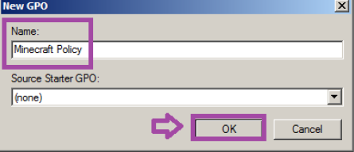

### Control Panel Policy Review

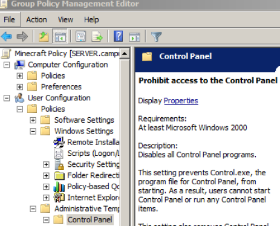

### Restriction Policy Enabled

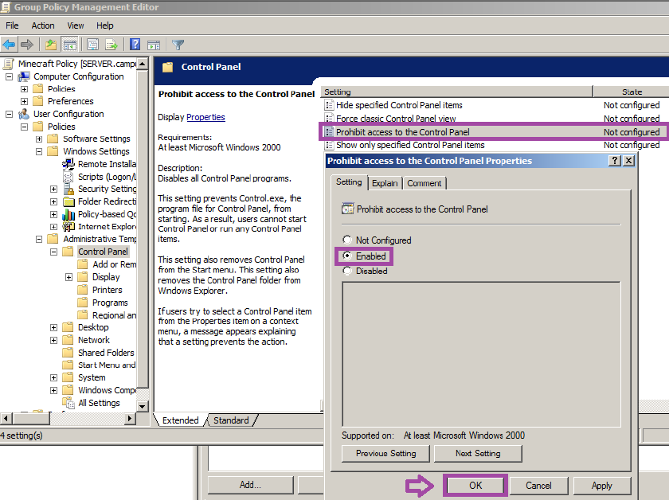

---

## Policy Deployment Recommendations

Policy updates should be validated through controlled propagation and enforcement testing procedures.

Recommended validation activities include:

- Run gpupdate after policy changes
- Verify policy application
- Validate user restrictions
- Test inherited permissions
- Monitor deployment consistency

Post-deployment validation improves:

- Administrative confidence
- Configuration accuracy
- Enterprise consistency
- Hardening reliability

### Group Policy Refresh Validation

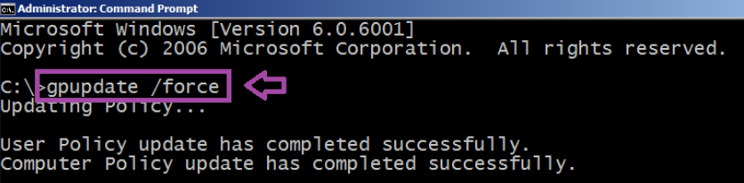

---

## Administrative Group Recommendations

Privileged groups should be reviewed regularly to reduce unnecessary administrative exposure.

Recommended practices include:

- Audit privileged memberships
- Remove inactive users
- Restrict administrative assignments
- Monitor delegated permissions
- Apply least privilege principles

Administrative review improves:

- Access governance
- Privilege management
- Security visibility
- Enterprise accountability

### Backup Operators Assignment

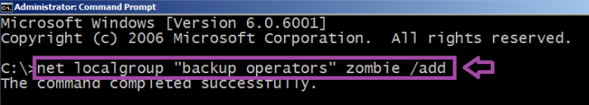

---

## Restriction Enforcement Recommendations

Enterprise restrictions should be validated through controlled user testing to confirm policy effectiveness.

Recommended validation procedures include:

- Test restricted functionality
- Validate denied access workflows
- Monitor user policy inheritance
- Review enforcement consistency
- Audit user restriction effectiveness

The assessment demonstrated successful restriction enforcement against Control Panel access.

### Restriction Enforcement Validation

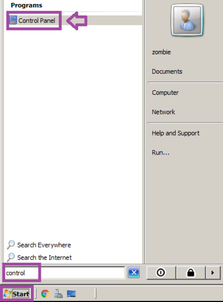

---

## Defensive Security Considerations

This assessment demonstrated several enterprise hardening concepts associated with:

- Active Directory administration
- Centralized authentication management
- Password security enforcement
- Group Policy deployment
- OU segmentation
- User restriction enforcement
- Administrative access governance
- Enterprise Windows hardening

These workflows are operationally relevant during:

- Enterprise administration
- Identity and access management
- Security operations
- Windows domain hardening
- Administrative policy enforcement
- Enterprise security reviews

---

## Defensive Assessment

The assessment demonstrated how centralized Group Policy administration and Active Directory hardening improve enterprise security consistency and administrative visibility across Windows domain environments.

The workflow also reinforced the operational importance of password security enforcement, OU segmentation, restriction validation, and centralized identity management within enterprise defensive operations.
