# Linux System Hardening and Service Reduction

## Overview

This project documents a Linux hardening and attack surface reduction assessment performed against an Ubuntu-based system hosted in a controlled lab environment.

The assessment focused on identifying insecure network services, validating weak configurations, reviewing credential exposure risks, and applying defensive hardening actions to reduce system exposure.

The project demonstrates both offensive validation and defensive remediation workflows commonly associated with Linux system administration and enterprise hardening operations.

---

## Assessment Scope

The assessment focused on the following areas:

- Network service exposure review
- Anonymous FTP access validation
- SMB share enumeration
- Credential exposure analysis
- Password hash review and cracking validation
- Insecure protocol exposure
- Root account access review
- Duplicate UID 0 account analysis
- Service reduction and removal
- Linux package update operations
- Post-hardening validation activities

---

## Tools Used

| Tool | Purpose |
|------|----------|
| Nmap | Network service enumeration |
| FTP Client | FTP access validation |
| SMBClient | SMB share enumeration |
| John the Ripper | Password hash cracking validation |
| OpenSSH Client | SSH access validation |
| Telnet Client | Insecure remote access testing |
| Ubuntu Package Manager (APT) | Package management and service removal |

---

## Initial Exposure Review

### Initial Network Service Exposure

The system was initially scanned to identify externally accessible services and unnecessary exposure.

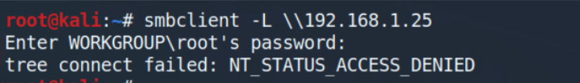

---

### Anonymous FTP Access Validation

Anonymous FTP authentication was successfully validated against the exposed FTP service.

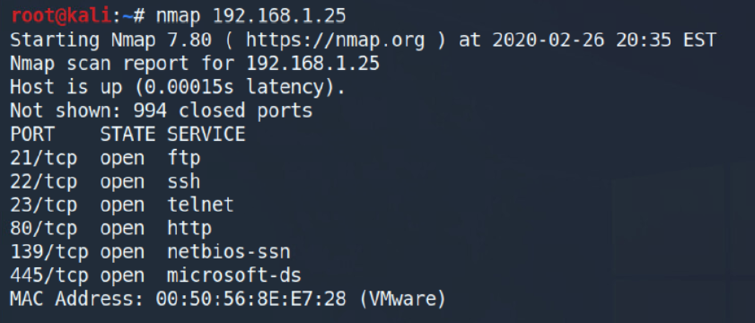

---

### Sensitive File Exposure

Sensitive system files were accessible through the FTP service.

#### Passwd File Download

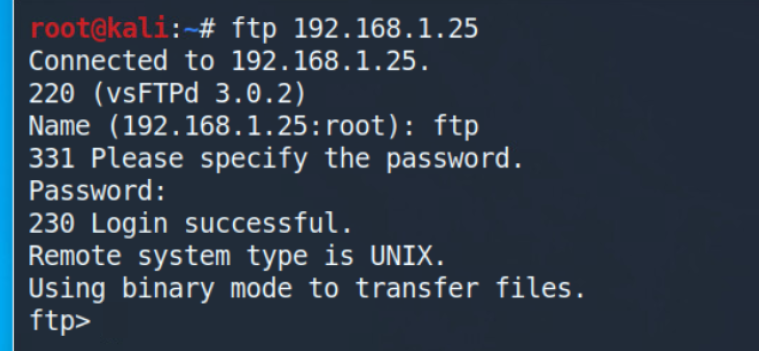

#### Shadow File Download

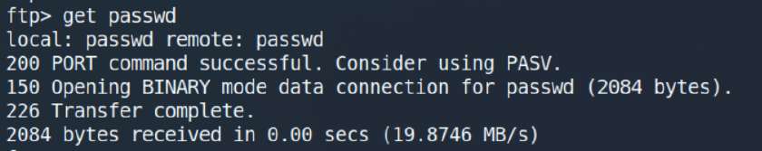

---

### Password Hash Review

Extracted password hashes were reviewed for offline password cracking exposure.

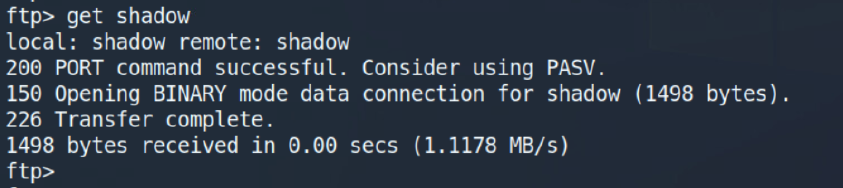

---

### Password Cracking Validation

Password cracking activity successfully identified weak credentials from extracted password hashes.

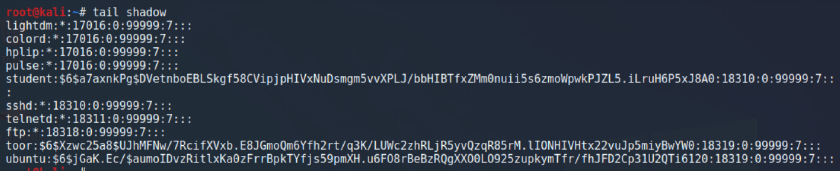

---

### Root SSH Access Validation

Direct root SSH authentication was successfully validated.

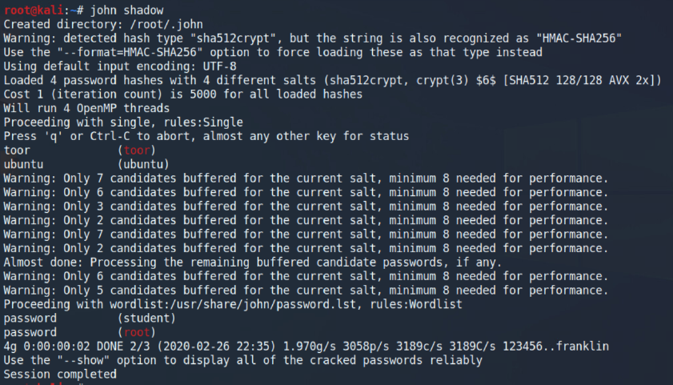

---

### Insecure Telnet Access

Telnet exposure allowed plaintext remote authentication access.

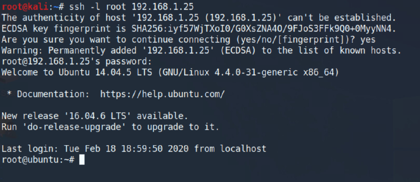

---

### Default Apache Web Exposure

The default Apache web page confirmed active HTTP service exposure.

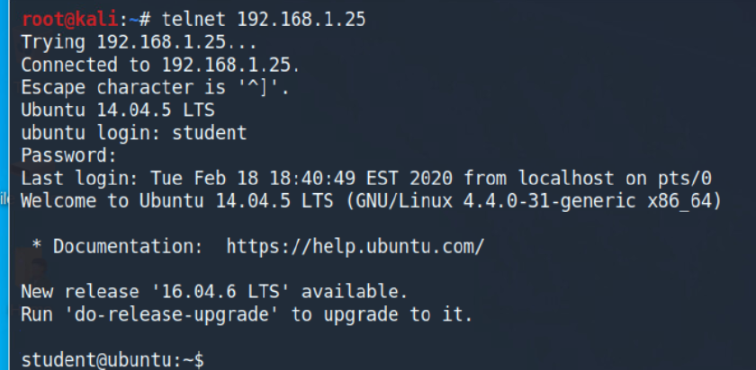

---

### SMB Share Enumeration

SMB shares were accessible through anonymous enumeration.

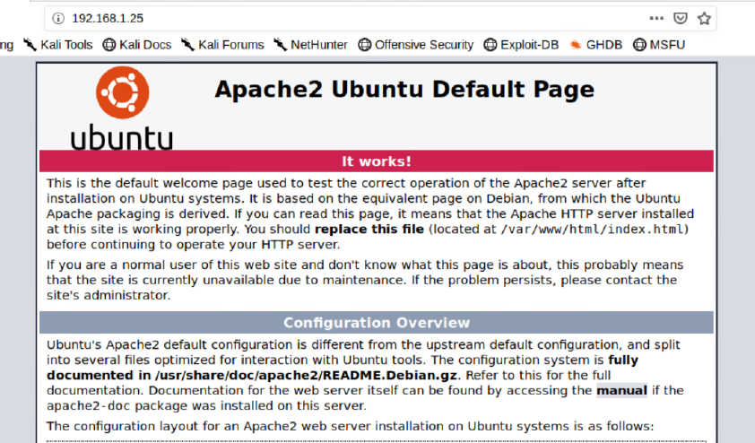

---

### Unauthorized SMB File Write Validation

File upload activity demonstrated weak SMB share permissions.

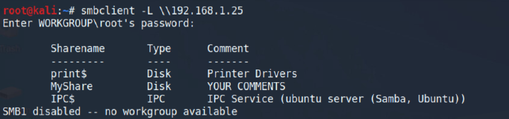

---

## Privilege and Account Review

### Duplicate UID 0 Account Detection

The system contained an additional account configured with UID 0 privileges.

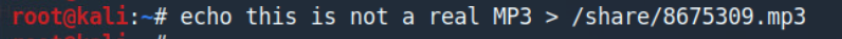

---

### Unauthorized Root-Level Account Removal

The duplicate privileged account was removed during remediation activities.

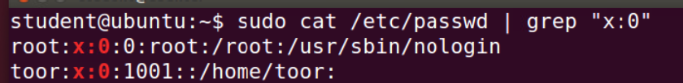

---

## Service Hardening Activities

### FTP Service Removal

The FTP service was removed to reduce unnecessary external exposure.

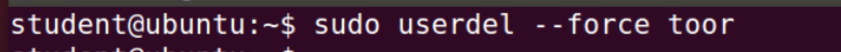

---

### Telnet Service Removal

The insecure Telnet service was removed from the system.

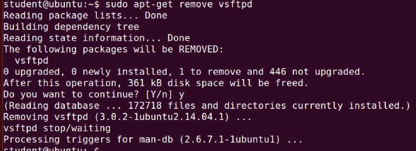

---

### Apache Service Removal

The Apache web service was removed to minimize attack surface exposure.

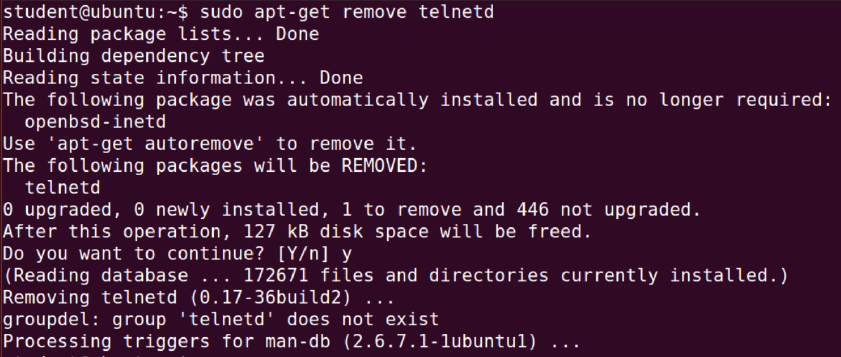

---

### Linux Package Updates

System packages were reviewed and updated as part of hardening activities.

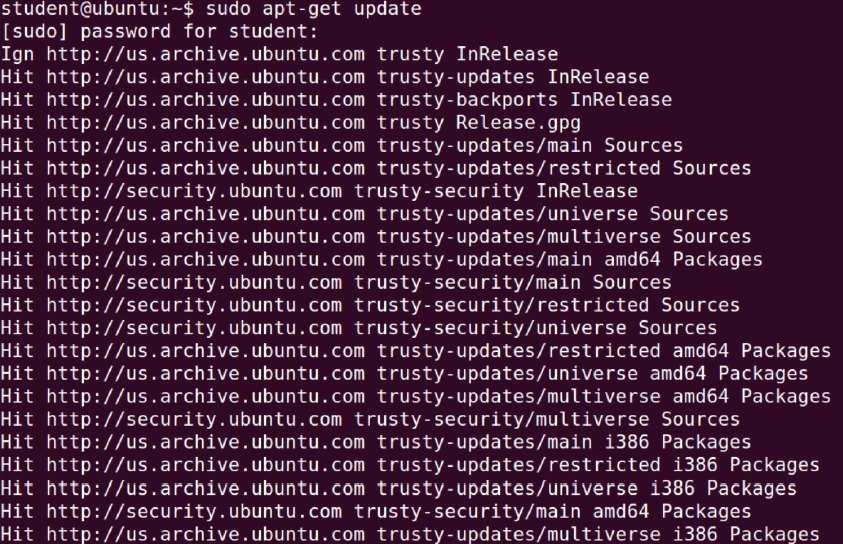

---

## Post-Hardening Validation

Post-remediation validation activities confirmed reduced service accessibility and restricted SMB exposure.

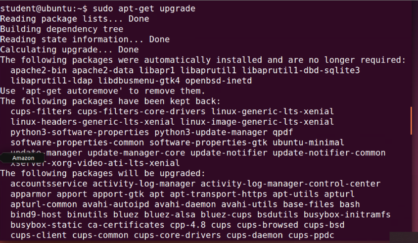

---

## Key Findings

- Multiple unnecessary services were externally exposed
- Anonymous FTP access enabled sensitive file retrieval
- Password hashes were accessible for offline cracking
- Weak passwords were successfully identified
- Root SSH authentication increased privilege exposure risk
- Telnet allowed insecure plaintext authentication
- SMB shares allowed unauthorized access and file upload activity
- A duplicate UID 0 account created elevated privilege risk
- Hardening activities reduced unnecessary service exposure

---

## Defensive Value

This project demonstrates practical defensive security workflows involving:

- Linux hardening operations
- Service exposure reduction
- Credential security review
- Password policy awareness
- Remote access hardening
- SMB exposure validation
- Attack surface reduction
- Linux administration security practices

---

## Environment Details

| Component | Details |
|-----------|---------|
| Operating System | Ubuntu Linux |
| Assessment Type | Linux Hardening Assessment |
| Focus Area | Service Reduction and Exposure Mitigation |
| Network Services Reviewed | FTP, SMB, SSH, HTTP, Telnet |
| Analysis Platform | Kali Linux + Ubuntu Lab |

---

## Analyst Assessment

The assessment demonstrated how insecure default services, weak authentication controls, and excessive network exposure can significantly increase attack surface risk within Linux environments.

The hardening workflow improved the overall security posture by removing unnecessary services, reducing external accessibility, reviewing privileged account exposure, and validating defensive remediation activities.
