# Investigation Findings

## Network Exposure Findings

Initial network enumeration identified multiple externally accessible services exposed on the Windows Server environment, including:

- FTP
- HTTP
- SMB
- NetBIOS-related services

The exposed services increased attack surface visibility and provided multiple potential entry points for unauthorized access attempts.

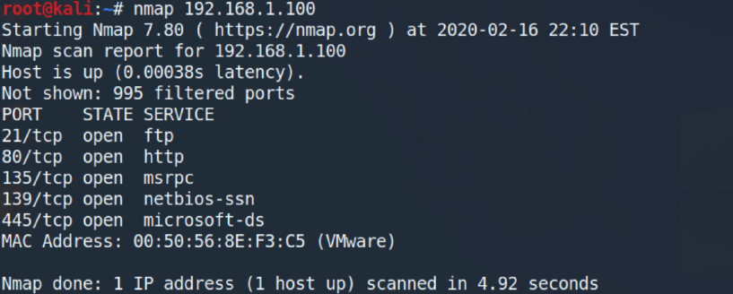

---

## Anonymous FTP Findings

The assessment confirmed that the FTP service permitted anonymous authentication without requiring valid user credentials.

The anonymous FTP configuration exposed the system to several security risks, including:

- Unauthenticated access
- Unauthorized file retrieval
- Potential data exposure
- Increased attack surface visibility

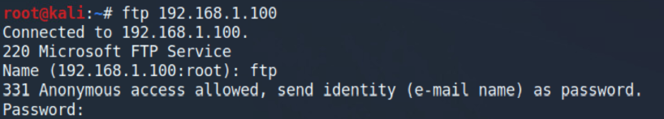

---

## Unauthorized File Upload Findings

Validation activities confirmed that anonymous users were capable of uploading files directly to the FTP service.

This behavior demonstrated insecure write permissions and insufficient access restrictions on the exposed service.

Observed risks included:

- Unauthorized content storage
- Potential malware staging
- Untrusted file hosting
- Abuse of exposed network services

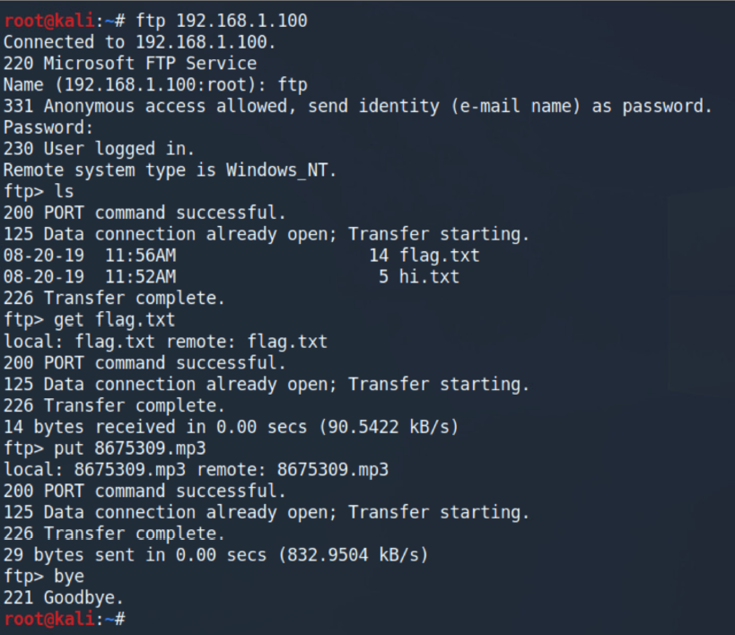

---

## IIS Exposure Findings

The target system exposed a default IIS web interface that had not been configured for operational use.

The default web service exposure indicated:

- Unnecessary active services
- Default configuration exposure
- Increased attack surface visibility
- Lack of service hardening

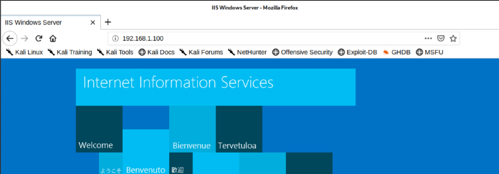

---

## SMB Enumeration Findings

SMB enumeration activities identified accessible network shares and confirmed visibility into exposed SMB-related services.

The assessment demonstrated that SMB enumeration could be performed without sufficient access restrictions prior to remediation activities.

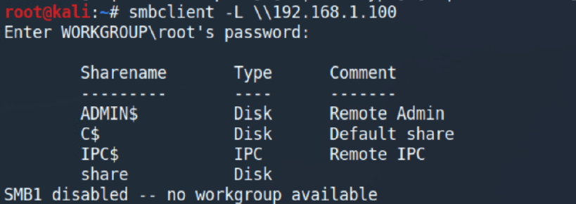

---

## MS17-010 Exposure Findings

The assessment validated vulnerable SMB exposure conditions associated with MS17-010 prior to hardening activities.

Validation activities confirmed that the target environment exposed vulnerable SMB-related conditions capable of supporting elevated access execution workflows.

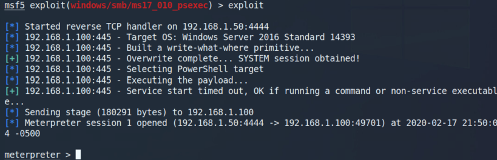

---

## Elevated Access Findings

Validation activities confirmed elevated command execution capability on the target system during the assessment workflow.

The successful validation demonstrated the operational impact of insecure SMB exposure conditions and insufficient hardening controls.

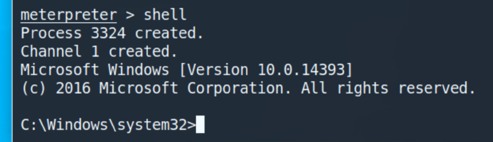

---

## IIS Hardening Findings

Hardening activities successfully removed unnecessary IIS-related services from the Windows Server environment.

The removal reduced externally exposed services and improved overall attack surface management.

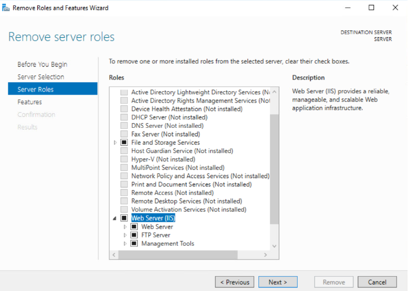

---

## Post-Hardening Verification Findings

Post-remediation network rescanning confirmed successful exposure reduction following hardening activities.

The reassessment demonstrated that previously exposed services were no longer externally accessible after remediation.

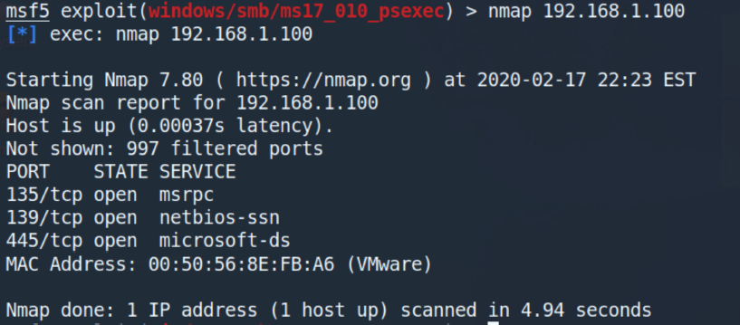

---

## Guest Account Hardening Findings

The Guest account was successfully disabled during hardening activities to reduce unauthorized access exposure.

The change improved local account security posture and reduced unauthenticated access opportunities.

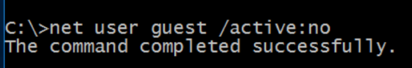

---

## SMB Restriction Findings

Post-hardening SMB enumeration attempts resulted in access denial responses, confirming improved access restriction enforcement after remediation activities.

The validation demonstrated successful reduction of unauthorized SMB visibility within the environment.

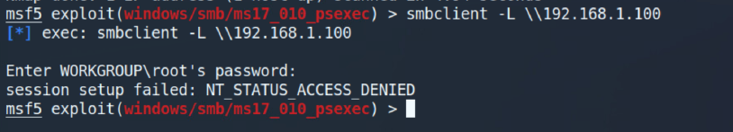

---

## Administrative Account Review Findings

Administrative group membership visibility was reviewed to identify privileged account exposure and validate administrative access controls.

The review highlighted the operational importance of monitoring privileged account assignments within Windows environments.

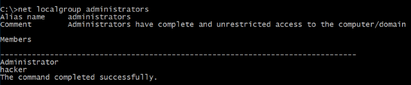

---

## Investigation Summary

The assessment successfully demonstrated:

- Network exposure enumeration
- Anonymous service validation
- Unauthorized access visibility
- SMB exposure review
- Vulnerability validation workflows
- Windows service hardening
- Exposure reduction verification
- Post-remediation reassessment activities

The investigation also demonstrated the importance of continuous hardening, exposure management, and remediation verification within defensive security operations.
