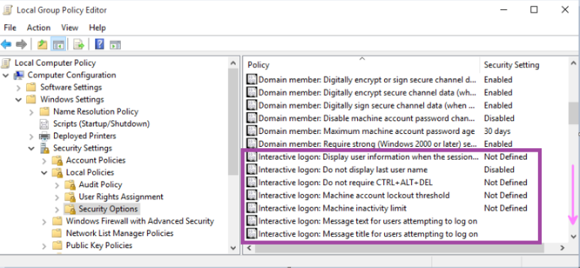
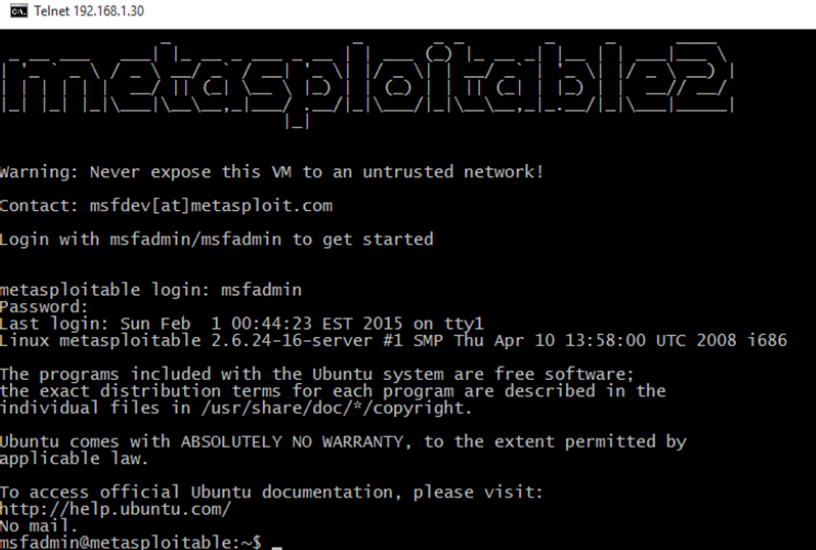

# Windows & Linux Security Hardening Assessment

## Investigation Overview

This project documents a combined Windows and Linux hardening assessment focused on reducing attack surface exposure, improving authentication security, validating audit visibility, and verifying post-hardening remediation effectiveness across multiple operating systems.

The assessment included insecure service identification, authentication review, local policy analysis, audit logging validation, Linux firewall hardening, and post-remediation network verification workflows.

---

## Security Assessment Scope

The assessment focused on the following security areas:

- Windows authentication security
- Local security policy review
- Interactive logon configuration
- Audit logging validation
- Linux account management
- Telnet exposure analysis
- Firewall hardening
- Port exposure reduction
- Post-hardening verification

---

## Tools Used

| Tool | Purpose |
|------|----------|
| Local Group Policy Editor | Windows security configuration review |
| Event Viewer | Audit log analysis |
| Netplwiz | Windows authentication enforcement |
| Zenmap / Nmap | Network exposure analysis |
| iptables | Linux firewall hardening |
| auth.log | Linux authentication log review |
| Telnet Client | Insecure remote access validation |

---

## Analysis Areas

### Windows Authentication Enforcement

Authentication settings were reviewed to validate local login enforcement controls and reduce insecure authentication behavior.

---

### Local Security Policy Review

Windows local security policy settings were reviewed to assess authentication, logon behavior, and local security configuration visibility.

---

### Interactive Logon Policy Analysis

Interactive logon security configurations were reviewed to validate user notification and logon policy visibility.

---

### Warning Banner Configuration

A security warning banner was configured to improve user awareness and reinforce acceptable use visibility during authentication workflows.

---

### Logon Warning Validation

The configured authentication warning banner was validated during the login workflow.

---

### Audit Policy Configuration

Audit failure logging policies were enabled to improve authentication monitoring visibility and security event tracking.

---

### Event Viewer Audit Analysis

Windows Event Viewer logs were reviewed to validate failed authentication event visibility and audit logging functionality.

---

### Initial Linux Exposure Review

Initial network enumeration identified exposed Linux services, including insecure Telnet access visibility prior to hardening activities.

---

### Insecure Telnet Access Validation

Telnet authentication exposure was reviewed to demonstrate insecure remote access visibility and plaintext authentication risks.

---

### Linux Account Validation

Linux user account creation and identity validation activities were reviewed through local account visibility workflows.

---

### Authentication Log Analysis

Linux authentication logs were reviewed to validate account activity visibility and authentication event monitoring.

---

### Firewall Hardening

iptables firewall rules were configured to reduce exposed network services and restrict unauthorized inbound access.

#### Default DROP Policy

#### HTTP Allow Rule

---

### Post-Hardening Exposure Verification

Post-remediation network enumeration confirmed reduced port exposure visibility after firewall hardening activities.

---

## Investigation Findings

- Reviewed Windows authentication enforcement controls
- Validated local security policy visibility
- Enabled authentication audit failure logging
- Confirmed Windows security event visibility
- Identified insecure Telnet exposure conditions
- Reviewed Linux authentication activity logs
- Configured Linux firewall restrictions using iptables
- Reduced exposed network services through firewall hardening
- Verified post-hardening exposure reduction through rescanning workflows

---

## Defensive Value

This project demonstrates operational security concepts associated with:

- Operating system hardening
- Authentication security
- Audit logging visibility
- Windows security policy review
- Linux firewall management
- Exposure reduction
- Network service restriction
- Post-hardening validation workflows

---

## Environment Details

| Component | Details |
|-----------|---------|
| Windows Platform | Windows 10 |
| Linux Platform | Metasploitable 2 |
| Firewall Technology | iptables |
| Network Analysis | Nmap / Zenmap |
| Assessment Type | Security Hardening Assessment |

---

## Analyst Assessment

The assessment demonstrated how insecure authentication methods, exposed legacy services, and insufficient firewall restrictions can increase attack surface visibility across Windows and Linux environments.

The workflow also highlighted the operational importance of audit visibility, authentication monitoring, firewall hardening, and post-remediation verification during defensive security operations.
