# Mitigations & Defensive Recommendations

## Hardening Overview

The assessment identified multiple insecure configurations and exposed services across Windows and Linux environments that increased attack surface visibility and reduced defensive security posture.

Hardening activities focused on:

- Authentication enforcement
- Audit visibility improvements
- Legacy protocol reduction
- Firewall restriction enforcement
- Exposure reduction validation
- Post-remediation verification

---

## Windows Authentication Recommendations

The assessment demonstrated the importance of enforcing secure local authentication workflows on Windows systems.

Recommended mitigation actions include:

- Require credential-based logins
- Disable automatic logon behavior
- Enforce strong password policies
- Restrict shared account usage
- Enable account lockout protections

These controls improve:

- Local authentication security
- Unauthorized access prevention
- Credential protection
- Administrative accountability

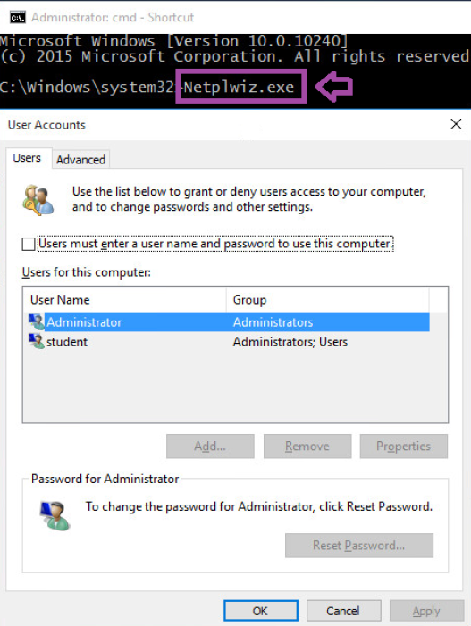

---

## Local Security Policy Recommendations

Windows Local Security Policy settings should be reviewed regularly to ensure systems maintain secure baseline configurations.

Recommended controls include:

- Interactive logon restrictions
- Security banner enforcement
- Password policy review
- Audit policy configuration
- Administrative rights review

Regular policy reviews improve:

- Security baseline consistency
- Administrative visibility
- Authentication governance
- System hardening posture

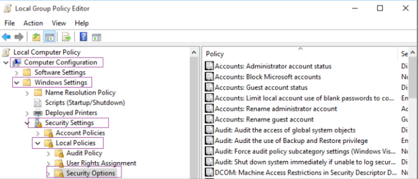

---

## Authentication Warning Recommendations

Warning banners should be configured to improve authentication awareness and reinforce organizational security policies.

Recommended practices include:

- Display authentication warnings before login
- Maintain acceptable use notifications
- Standardize login messaging
- Ensure policy consistency across systems

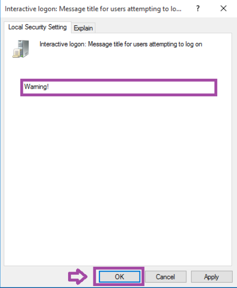

### Login Warning Validation

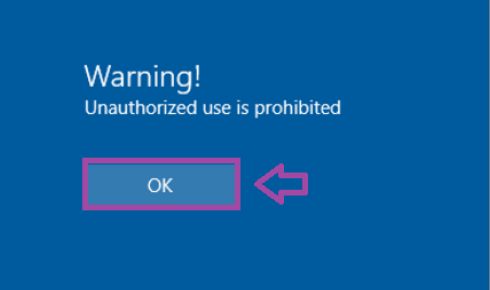

---

## Audit Logging Recommendations

Authentication audit logging should be enabled to improve visibility into failed login activity and unauthorized access attempts.

Recommended controls include:

- Enable failed login auditing
- Centralize authentication logs
- Retain security event records
- Monitor authentication anomalies
- Alert on repeated failures

Audit visibility improves:

- Incident detection
- Brute-force monitoring
- Authentication investigations
- Security operations workflows

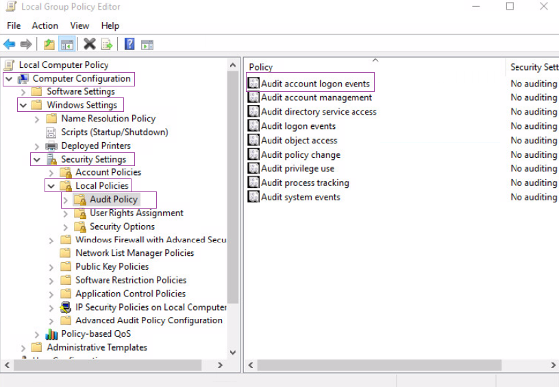

### Event Viewer Audit Visibility

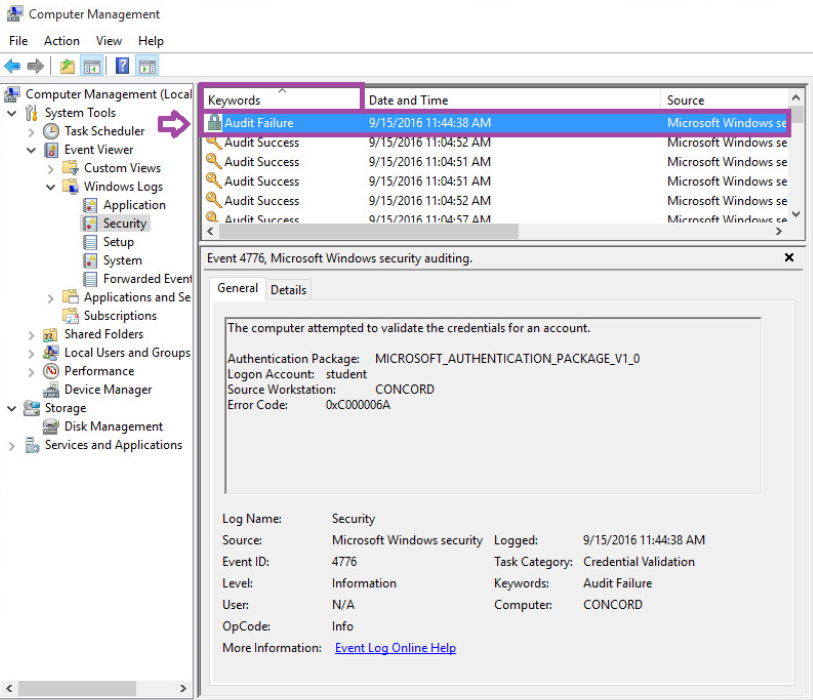

---

## Legacy Protocol Mitigation Recommendations

The assessment identified Telnet exposure within the Linux environment using insecure plaintext authentication.

Recommended mitigation actions include:

- Disable Telnet services
- Replace Telnet with SSH
- Restrict remote administration exposure
- Encrypt authentication traffic
- Remove unused legacy services

Replacing insecure protocols reduces:

- Credential interception risk
- Unauthorized remote access exposure
- Plaintext traffic visibility
- Administrative security weaknesses

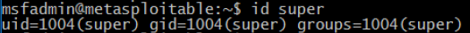

---

## Linux Account Management Recommendations

Linux account management should be monitored continuously to reduce unauthorized account creation and improve administrative visibility.

Recommended controls include:

- Review local accounts regularly
- Remove inactive accounts
- Monitor account creation activity
- Audit privileged users
- Enforce least privilege principles

Authentication logs should also be reviewed regularly to improve visibility into:

- User activity
- Administrative actions
- Authentication events
- Privileged account behavior

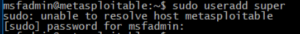

### Authentication Log Visibility

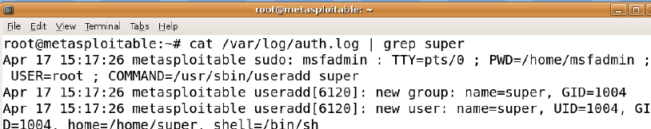

---

## Firewall Hardening Recommendations

iptables firewall rules were implemented to reduce exposed services and restrict inbound access visibility.

Recommended firewall practices include:

- Deny unnecessary inbound traffic
- Allow only required services
- Restrict exposed ports
- Review firewall rules regularly
- Validate rule effectiveness through rescanning

The assessment demonstrated the value of applying:

- Default deny policies
- Service-specific allow rules
- Exposure reduction workflows
- Post-remediation verification

### Default DROP Policy

### HTTP Allow Rule

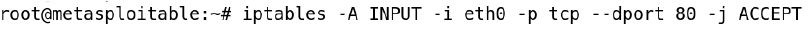

---

## Exposure Verification Recommendations

Post-remediation rescanning confirmed reduced network exposure after firewall hardening activities.

Organizations should implement:

- Continuous exposure scanning
- Regular reassessment procedures
- Post-hardening validation
- Service inventory reviews
- Attack surface monitoring

Verification workflows improve:

- Remediation confidence
- Exposure awareness
- Security posture visibility
- Operational resilience

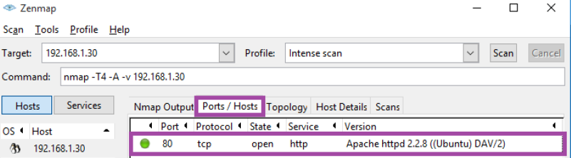

---

## Defensive Security Considerations

This assessment demonstrated several defensive security concepts associated with:

- Authentication hardening
- Audit visibility
- Security policy enforcement
- Legacy protocol reduction
- Firewall management
- Exposure reduction
- Post-remediation verification
- Security baseline validation

These activities are operationally relevant during:

- Security operations reviews
- Infrastructure hardening
- System administration
- Exposure management assessments
- Defensive remediation workflows

---

## Defensive Assessment

The assessment demonstrated how authentication security, audit logging, firewall hardening, and exposure reduction workflows improve defensive security posture across Windows and Linux environments.

The investigation also reinforced the operational importance of continuous hardening, authentication monitoring, and post-remediation reassessment activities during defensive security operations.
